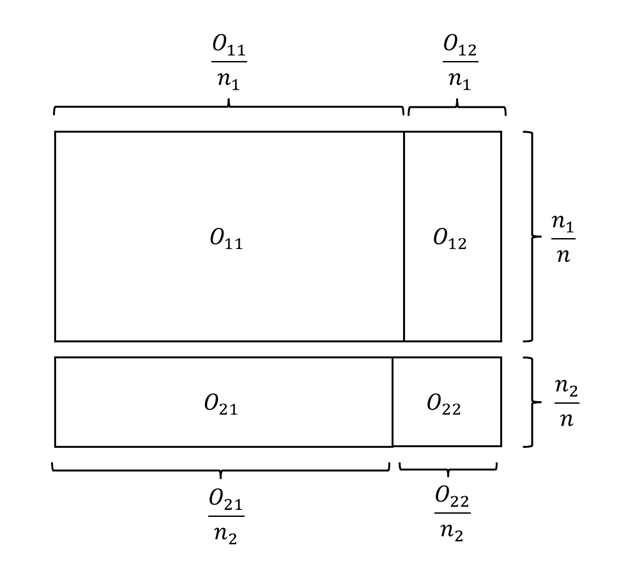
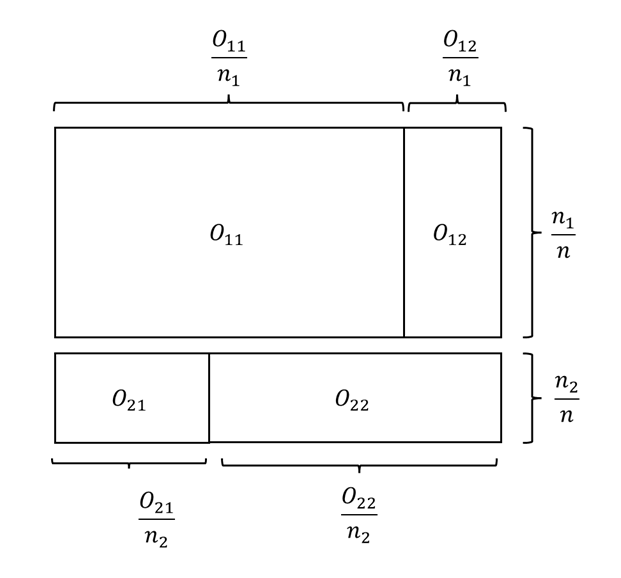

# Tabelas de contingência

## Introdução

Uma tabela de contingência é uma matriz de números naturais que representam frequências absolutas. Por exemplo, um entomologista coletou 37 insetos, conforme a seguinte tabela de contingência 
    
$$\begin{array}{ccc|c}\hline
    \hbox{Mariposa} & \hbox{Gafanhoto} & \hbox{Outros} &\hbox{Total} \\ \hline
       12  & 22& 3 &37 \\ \hline
    \end{array}$$

A tabela acima é uma tabela de contingência univariada e representa observações de uma variável categórica com três classes: Mariposa, Gafanhoto, Outros. 
\end{frame}
O entomologista pode aumentar o nível de informação adicionando o evento no qual o inseto foi encontrado vivo. A nova tabela de contingência fica:
    
$$\begin{array}{c|ccc|c}\hline
             &  \hbox{Mariposa} & \hbox{Gafanhoto} & \hbox{Outros} & \hbox{Total}\\ \hline
             \hbox{Vivo} & 3 & 21 & 3 & 27 \\
             \hbox{Morto} & 9&1&0&10\\ \hline
             \hbox{Total}&12&22&3&37\\ \hline
        \end{array}$$    

Agora, a tabela apresenta observações e um par de variáveis categóricas, uma com as classes {Mariposa, Gafanhoto, Outros} e outra com as classes {Vivo, Morto}. Note que a coluna Total se refere ao total marginal das linhas, enquanto que a linha Total se refere ao total marginal das colunas.

As tabelas construídas com duas variáveis são denominadas **tabelas de dupla entrada** ou ainda tabelas de contingência $r\times c$ onde $r$ é o número de linhas (categorias da primeira variável) e $c$ o número de colunas (categorias da segunda variável).

As tabelas de contingência podem ter múltiplas entradas. Abaixo, mostramos uma tabela com três entradas com informações dos tripulantes do Titanic. As variáveis são Sobreviveu (Sim/Não), Sexo (Masculino/Feminino) e Classe (1ª,2ª,3ª), configurando um tabela $2\times 2\times 3$.

$$\begin{array}{l l |c c c |r}
\hline
\text{Sobreviveu} & \text{Sexo} & \text{Classe 1ª} & \text{Classe 2ª} & \text{Classe 3ª} & \text{Total} \\
\hline
\text{Não} & \text{Feminino} & 3 & 6 & 72 & \mathbf{81} \\
 & \text{Masculino} & 118 & 146 & 358 & \mathbf{622} \\
\hline
\text{Sim} & \text{Feminino} & 91 & 70 & 72 & \mathbf{233} \\
 & \text{Masculino} & 57 & 17 & 75 & \mathbf{149} \\
\hline
\textbf{Total} & & \mathbf{269} & \mathbf{239} & \mathbf{577} & \mathbf{1085} \\
\hline
\end{array}$$

## Tabela $2\times 2$

### O Teste Qui-quadrado para diferenças entre probabilidades em tabelas 2$\times 2$

Sejam $X_1,\ldots,X_{n_1}$ e $Y_1,\ldots,Y_{n_2}$ duas amostras aleatórias, independentes entre si,
onde $X_i$ e $Y_j$ só podem assumir duas classes. Esses resultados são organizados em um tabela de contingência de dupla entrada, como essa abaixo:
    
$$\begin{array}{c|cc|c}\hline
             & \hbox{Classe 1}& \hbox{Classe 2} & \hbox{Total} \\ \hline
           \hbox{Amostra 1 } (X)  & O_{11} & O_{12} & n_1\\
           \hbox{Amostra 2 } (Y)  & O_{21} & O_{22} & n_2 \\ \hline
           \hbox{Total} &C_1 & C_2 & N=n_1+n_2\\
        \end{array}$$

Sejam $p_X$ e $p_Y$ as probabilidades de ocorrência do evento na classe 1 para as populações de $X$ e $Y$, respectivamente. Estamos interessados nas seguintes hipóteses:
    
Teste bilateral:
    
$$\begin{align*}
        H_0&: p_X=p_Y \\
        H_1&:p_X\neq p_Y
    \end{align*}$$
        
Teste unilateral: 
 
$$\begin{align*}
 \left\{\begin{array}{l}H_0: p_X\leq  p_Y \\ H_1:p_X>p_Y \end{array}\right.\;\;\;\;\;\left\{ \begin{array}{l}H_0:p_X\geq p_Y \\ H_1:p_X<p_Y \end{array}\right.
 \end{align*}$$

É natural comparar $O_{11}/n_1$ contra $O_{21}/n_2$ realizar o teste. Para a hipótese simples, sob $H_0:p_X=p_Y=p$, teremos que 

$$\begin{align}O_{11}\sim\hbox{Binomial}(n_1,p)\\O_{21}\sim\hbox{Binomial}(n_2,p)\end{align}$$
Como
$$\begin{align}E\left(\frac{O_{11}}{n_1}-\frac{O_{21}}{n_2}\right)=&0\\Var\left(\frac{O_{11}}{n_1}-\frac{O_{21}}{n_2}\right)&=\left(\frac{1}{n_1}+\frac{1}{n_2}\right)p(1-p)\end{align},$$
teremos que, pelo Teorema Central do Limite,

$$\begin{align}\frac{\frac{O_{11}}{n_1}-\frac{O_{21}}{n_2}}{\sqrt{\left(\frac{1}{n_1}+\frac{1}{n_2}\right)p(1-p)}}&=\frac{1}{\sqrt{n_1n_2}}\frac{O_{11}n_2-O_{21}n_1}{\sqrt{Np(1-p)}}\\ &=\frac{1}{\sqrt{n_1n_2}}\frac{O_{11}O_{21}-O_{12}O_{21}}{\sqrt{Np(1-p)}}\stackrel{D}{\to}N(0,1)\end{align}.$$
Agora, observe que, pela Lei Forte dos Grandes Números

$$\hat{p}=\frac{C_1}{N}\stackrel{P}{\to}p$$
o que implica em
$$\hat{p}(1-\hat{p})=\frac{C_1}{N}\frac{C_2}{N}\stackrel{P}{\to}p(1-p).$$
Portanto, pelo Teorema de Slutsky, teremos que
$$\frac{1}{\sqrt{n_1n_2}}\frac{O_{11}O_{22}-O_{12}O_{21}}{\sqrt{N\hat{p}(1-\hat{p})}}=\sqrt{N}\frac{O_{11}O_{22}-O_{12}O_{21}}{\sqrt{n_1n_2C_1C_2}}\stackrel{D}{\to}N(0,1)$$

<div class='alert alert-success'>
**Sobre a validade da aproximação**

A estatística do teste Qui-quadrado para a diferença entre probabilidades em tabelas $2\times 2$ é

$$T_1=\sqrt{N}\frac{O_{11}O_{22}-O_{12}O_{21}}{\sqrt{n_1n_2C_1C_2}},$$
e é equivalente  a etatística do teste Z para diferença entre proporções. Para grandes amostras, a região de rejeição para a hipótese nula simples é
$$R=\{t_1: |t_1|>z_{1-\alpha/2}\}$$
onde $z_{1-\alpha/2}$ é o quantil $(1-\alpha/2)$ da normal padrão. Podemos, alternativamente, fazer $T_2=T_1^2$, com região de rejeição
$$R=\{t_2: t_2>\chi^2_{1,1-\alpha}\}$$
onde $\chi^2_{\nu,1-\alpha}$ é o quantil $(1-\alpha)$ da distribuição $\chi^2_\nu$.

Para o teste unilateral, utilizamos a distribuição normal padrão, desde que o tamanho da amostra permita o uso do TCL.

Via de regra, considera-se que o TCL é razoável considerando a distribuição binomial como base quando

* $np \geq 5$ (Número esperado de sucessos)

* $n \cdot (1-p) \geq 5$ (Número esperado de fracassos)

Conforme discutido, sob $H_0$ $p$ pode ser $\hat{p}=C_1/n$. Portanto, é sempre útil observar a tabela de contagens esperadas:


$$\begin{array}{c|cc|c}\hline
             & \hbox{Classe 1}& \hbox{Classe 2} & \hbox{Total} \\ \hline
           \hbox{Amostra 1 } (X)  & E_{11}=n_1\hat{p} & E_{12}=n_1(1-\hat{p}) & n_1\\
           \hbox{Amostra 2 } (Y)  & E_{21}=n_2\hat{p} & E_{22}=n_2(1-\hat{p}) & n_2 \\ \hline
           \hbox{Total} &C_1 & C_2 & N\\ \hline
        \end{array}$$

Contudo, é importante ressaltar ser existe um modo de realizar um teste exato, via método de Monte Carlo. Tal solução é apresentada na seção seguinte, sobre Teste Exato de Fisher e o teste de permutação.
</div>


::: {#exm-dois_lotes}
Dois carregamentos de itens manufaturados foram selecionados ao acaso e seus itens foram inspecionados. O objetivo é testar se há diferença entre as proporções de itens defeituosos nos dois carregamentos. Os dados foram organizados na seguinte tabela de contingência 

$$\begin{array}{c|cc|c}\hline
         & \hbox{Defeituoso} & \hbox{Não defeituoso} & \hbox{Total}\\ \hline
     \hbox{Carregamento 1}    & 13 & 73 & 86 \\
     \hbox{Carregamento 2} & 17 & 57 & 74 \\ \hline
     \hbox{Total}& 30 & 130 & 160 \\ \hline
    \end{array}$$

Seja $p_1$ a probabilidade de defeito no carregamento 1 e $p_2$ o mesmo para o carregamento 2. Nossa hipótese nula é $H_0: p_1=p_2$. 

A estatística do teste Qui-quadrado é

$$t_{obs}=\sqrt{160}\frac{13\cdot57-73\cdot17}{\sqrt{86\cdot74\cdot30\cdot130}}=-1,2695$$
    
Vamos encontrar a tabela de valores esperados, para determinar se o TCL é adequado ao problema. Como $\hat{p}=30/160=3/16$, a referida tabela segue abaixo:

$$\begin{array}{c|cc|c}\hline
         & \hbox{Defeituoso} & \hbox{Não defeituoso} & \hbox{Total}\\ \hline
     \hbox{Carregamento 1}    & 86\cdot\frac{3}{16}=16,125 & 86\cdot\frac{13}{16}=69,875 & 86 \\
     \hbox{Carregamento 2} & 74\cdot\frac{3}{16}=13,875 & 74\cdot\frac{13}{16}=60,125 & 74 \\ \hline
     \hbox{Total}& 30 & 130 & 160 \\ \hline
    \end{array}$$

Como todos os valores esperados são maiores que 5, temos que a aproximação normal é adequada. Como 
$$\begin{align}P(T_1\geq-1,2695)&=0,8978\\
P(T_1\leq-1,2695)&=0,1021\end{align}$$
logo,
$$p\hbox{-valor}=0,2042,$$
ou seja, não existem evidências de que há diferença na proporção de itens defeituosos dos dois carregamentos.
:::

::: {#exr-}
Na Academia Naval Americana, um novo sistema de iluminação foi instalado no dormitório dos aspirantes. Contudo, existe a conjectura de que o novo sistema está causando problemas de visão. Considere as hipóteses:
    
* $H_0:$ a proporção de aspirantes com boa visão é maior ou igual ao que era antes da instalação do novo sistema de iluminação 
        
* $H_1:$ a probabilidade de boa visão é menor do que era antes.

Um grupo de aspirantes 4 anos antes da instalação do novo sistema foi selecionado.  Outra amostra foi selecionada dentre os aspirantes que já entraram com o novo sistema de iluminação em funcionamento. Foram obtidos os seguintes dados
    
$$\begin{array}{c|cc|c}\hline
             &  \hbox{Boa visão} & \hbox{Visão prejudicada} & \hbox{Total} \\\hline
          \hbox{Aspirantes antes do sistema}   & 714 & 111& 825\\
          \hbox{Aspirantes depois do sistema} & 662 & 154 & 816 \\ \hline
          \hbox{Total} & 1376 & 265 & 1641 \\ \hline
        \end{array}$$


Verifique se a aproximação normal é plausível e teste a hipótese de que a visão dos aspirantes está sendo prejudicada com o novo sistema de iluminação.
:::


::: {#def-}
**Gráfico de mosaico**

O **gráfico de mosaico** é formado por retângulos, um para cada célula da tabela, dispostos na mesma ordem. A área dos retângulos é proporcional à sua frequência observada, apresentando uma inspeção visual direta das células. Os retângulos são construídos como segue:

* A altura do retângulo da  célula $(i,j)$ é proporcional ao total da linha ($n_i/n$). 

* A largura do retângulo da célula $(i,j)$ é proporcional à $O_{ij}/n_i$. 

Em um gráfico de mosaico, as linhas se comportam como um gráfico de barras empilhadas 100%, mostrando como as probabilidades de cada classe se dividem ao longo da linha. Sob $H_0$, esperamos que as divisões entre as colunas estejam alinhadas através das linhas. 


:::{#fig-mosaicos-residuos layout-ncol=2}

{#fig-mosaico_construirI}

{#fig-mosaico_construirII}

**Construção do gráfico de mosaico para tabelas 2x2.** (a) Ilustração de um mosaico com $H_0$ verdadeira. Observe como as linhas verticais são próximas. (b) Ilustração de um mosaico com $H_0$ falsa. Observe como as linhas verticais estão distantes.


**Observação.** Existem diferentes implementações do gráfico de mosaico. No `R`, vamos utilizar o pacote `vcd`, que possui a função `mosaic`, cuja a implementação é a mesma apresentada aqui. Já o pacote `graphics` (o pacote básico do `R`) possui a função `mosaicplot`, no qual  a altura do retângulo da  célula $(i,j)$ é proporcional ao total da coluna ($C_j/n$) e a largura do retângulo da célula $(i,j)$ é proporcional à $O_{ij}/C_j$. Portanto, ao utilizar outra função para fazer um gráfico de mosaico, as interpretações podem variar.  
:::

:::

::: {#exm-}
De volta ao exemplo @exm-dois_lotes,  vamos fazer o gráfico de mosaico.

```{r}
tabela <- matrix( c(13,17,73,57),2,2)
dimnames(tabela) <- list( Carregamento = c(1,2), Defeituoso = c('Sim','Não'))
tabela
```
```{r}
require(vcd)
mosaic(tabela)
```
Como discutido, olhando as linhas como gráficos de barras empilhadas, temos a representação das frequências da variável Defeituoso. Pode-se ver que as **linhas verticais** que dividem as classes de Defeituoso estão próximas, o que podem ser indícios de que $H_0$ não deve ser rejeitada. Vamos realizar o mesmo gráfico com a função `mosaicplot`:

```{r}
mosaicplot(tabela)
```
Observe que o gráfico é o mesmo, mas com a orientação trocada. Aqui, as colunas representam as frequências relativas de cada carregamento Deste modo, devemos rejeitar $H_0$ se as linhas horizontais que dividem as classes da variável Defeituoso estiverem distantes entre si (desalinhadas).

Essa proximidade visual das linhas confirma o resultado obtido pelo teste de hipóteses (p-valor=0,2042), indicando que a variação observada entre os carregamentos 1 e 2 pode ser atribuída ao erro amostral, e não a uma diferença real nas probabilidades de defeito.
:::

::: {#exr-}
Durante um surto de uma nova variante de Dengue em Manaus, a Secretaria de Saúde comparou dois tipos de testes diagnósticos (Teste A e Teste B) em 100 pacientes sintomáticos. Queremos saber se a taxa de detecção de casos positivos depende do tipo de teste utilizado. 

$$\begin{array}{l|cc|c}\hline
 & \hbox{Teste Positivo (+)} & \hbox{Teste Negativo (-)} & \hbox{Total de Pacientes} \\ \hline\hbox{Teste tipo A} &40& 10& 50 \\ \hbox{Teste tipo B} & 20&30 &50 \\ \hline \hbox{Total}&60&40&N = 100\\ \hline\end{array}$$


1. Esboce o gráfico de mosaico

2. Verifique se há diferença entre os testes ao nível de significância de 5%.
:::

::: {#exr-}
O artigo Polack et al. (2020) apresenta um estudo clínico de fase 3 randomizado e controlado por placebo que avaliou a eficácia da vacina BNT162b2 (Pfizer-BioNTech COVID-19) em participantes com 16 anos ou mais sem evidências de infecção por SARS-CoV-2. A tabela abaixo apresenta o número de participantes por grupo e o número de casos de Covid-19.

$$\begin{array}{l|cc|c}\hline 
 & \hbox{Não teve Covid-19} & \hbox{Teve Covid-19} & \hbox{Total} \\ \hline 
 \hbox{Recebeu vacina} & 18.190 & 8 & 18.198 \\
 \hbox{Recebeu placebo} & 18.163& 162 & 18.325 \\ \hline
 \hbox{Total} & 36.353 & 170 & 36.523 \\ \hline
 \end{array}$$

Teste a hipótese de que a vacina é eficaz.
:::  


<div class='alert alert-success'>
**O teste exato da Barnard**

Por ser um teste aproximado, o teste Qui-quadrado não pode ser executado em todas as situações. Contudo, a estatística 

$$T_2=T_1^2=N\frac{(O_{11}O_{22}-O_{12}O_{21})^2}{n_1n_2C_1C_2},$$

ainda é uma estatística de teste válida, sendo que apenas sua distribuição sob a hipótese nula desconhecida. 

Conforme visto, essa estatística $T_2$ é função de $O_{11}$ e $O_{21}$, considerando que o tamanho das amostras (marginal das linhas) é conhecido. Portanto, sem perda de generalidade, escreveremos $$W=T_2(O_{11},O_{21}).$$

Como $W$ é função de $O_{11}$ e $O_{21}$, sabemos que

$$P(W=w)=\sum_{(o_{11},o_{21}): T_2=w}{n_1\choose o_{11}}p_1^{o_{11}}(1-p_1)^{n_1-o_{11}}{n_2\choose o_{21}}p_2^{o_{21}}(1-p_2)^{n_2-o_{21}}$$
e, considerando $H_0:p_1=p_2=p$, teremos

$$P(W=w|p)=\sum_{(o_{11},o_{21}): T_2=w}{n_1\choose o_{11}}{n_2\choose o_{21}}p^{c_{1}}(1-p)^{c_2}$$
Portanto, procuramos pelo ponto crítico $w^*$ no qual
$$\sup_{0\leq p\leq 1}P(W\geq w^*|p)\leq \alpha,$$
ou, de maneira equivalente, avaliamos a rejeição da hipótese nula através do p-valor

$$\hbox{p-valor}=\sup_{0\leq p\leq 1}P(W\geq w_{obs}|p).$$
Este é o teste de Barnard (1945). Sua lógica é construir todas as tabelas $2\times 2$ e encontrar $p$ que traz o pior cenário. Existem diversas implementações deste no `R`. Aqui, vamos utilizar o pacote `Exact`, com a função `exact.test`. Abaixo, apresentamos o uso dessa função para o conjunto de dados sobre o número de itens defeituosos em dois carregamentos.

```{r}
library(Exact)
tabela <- matrix( c(13,17,73,57),2,2)
dimnames(tabela) <- list( Carregamento = c(1,2), Defeituoso = c('Sim','Não'))

exact.test(tabela)
```

Observe que este p-valor é, como esperado, próximo do obtido via aproxomação normal (0,2042).
</div>


### O Teste Exato de Fisher 

Considere novamente que $X_1,\ldots,X_{n_1}$ e $Y_1,\ldots,Y_{n_2}$ são duas amostras aleatórias, independentes entre si, onde $X_i$ e $Y_j$ só podem assumir duas classes. Os resultados são organizados em uma tabela de contingência de dupla entrada, como essa abaixo:
    
$$\begin{array}{c|cc|c}\hline
             & \hbox{Classe 1}& \hbox{Classe 2} & \hbox{Total} \\ \hline
           \hbox{Amostra 1 } (X)  & O_{11} & O_{12} & n_1\\
           \hbox{Amostra 2 } (Y)  & O_{21} & O_{22} & n_2 \\ \hline
           \hbox{Total} &C_1 & C_2 & N=n_1+n_2\\ \hline
        \end{array}$$

Assim como na seção anterior, $H_0: p_1=p_2=p$, onde $p_i$ é a probabilidade de se obter a Classe 1 para a população da amostra aleatória $i$. 

Recorde novamente que $O_{11}\sim\hbox{Binomial}(n_1,p_1)$ e $O_{21}=C_1-O_{11}\sim\hbox{Binomial}(n_2,p_2)$, o que implica em

$$\begin{align}P(O_{11}=x,O_{21}=c_1-x)&={n_1 \choose x}p_1^x(1-p_1)^{n_1-x}{n_2 \choose c_1-x}p_2^{c_1-x}(1-p_2)^{n_2-c_1+x}\\&={n_1\choose x}{n_2\choose c_1-x}\left[\left.\frac{p_1}{1-p_1}\right/\frac{p_2}{1-p_2}\right]^x p_2^{c_2}(1-p_2)^{n_2-c_1}\end{align}$$
Fazendo 

$$\phi=\left.\frac{p_1}{1-p_1}\right/\frac{p_2}{1-p_2},$$
teremos

$$\begin{align}P(O_{11}=o_{11},O_{21}=c_1-x)&={n_1 \choose o_{11}}p_1^{o_{11}}(1-p_1)^{n_1-x}{n_2 \choose c_1-{o_{11}}}p_2^{c_1-{o_{11}}}(1-p_2)^{n_2-c_1+{o_{11}}}\\&={n_1\choose {o_{11}}}{n_2\choose c_1-{o_{11}}}\phi^{o_{11}} p_2^{c_1}(1-p_2)^{n_2-c_1}\end{align}$$

A razão entre a probabilidade de sucesso e a de fracasso é denominada **chance**, enquanto que $\phi$ é denominada **razão de chances**. É importante notar que $H_0$ pode ser reescrita como $H_0:\phi=1$.

As estatísticas suficientes para $(\phi,p_2)$ são $O_{11},C_1$. Contudo, como $C_1\sim\hbox{Binomial}(N,p_2)$, temos que ela é suficiente para $p_2$ e ancilar para $\phi$. Deste modo, a distribuição de ${o_{11}}|C_1$ não depende de $p$. Explicitamente, temos


$$
\begin{align}
P({O_{11}}=x|C_1=c_1)&=\frac{P(X=x,C_1=c_1)}{{N \choose c_1}p_2^{c_1}(1-p_2)^{N-c_1} }=\frac{P(X=x,X+Y=c_1)}{{N \choose c_1}p_2^{c_1}(1-p_2)^{N-c_1} }\\&=\frac{P(X=x,Y=c_1-x)}{{N \choose c_1}(1-p_2)^{c_1}p_2^{N-c_1} }=\frac{P(X=x)P(Y=c_1-x)}{{N \choose c_1}p_2^{c_1}(1-p_2)^{N-c_1} }\\&=
\frac{{n_1 \choose x}p_1^{x}(1-p_1)^{n_1-x}{n_2\choose c_1-x} p_2^{c_1-x}(1-p_2)^{n_2-c_1+x}}{ {N \choose c_1} p_2^{c_1}(1-p_2)^{N-c_1}}\\&=
\frac{{n_1 \choose x}{n_2 \choose c_1-x}}{{N \choose c_1}}\phi^x=\frac{{n_1 \choose x}{N-n_1 \choose c_1-x}}{{N \choose c_1}}\phi^x
\end{align}
$$
e, sob $H_0$, $O_{11}|C_1=c_1\sim\hbox{Hipergeométrica}(N,n_1,c_1)$. 

O **teste exato de Fisher** consiste em utilizar a estatística $O_{11}$ condicionada a $C_1=c_1$. Valores elevados de $O_{11}$ dão suporte para $H_1: p_1>p_2$, enquanto que valores baixos dão suporte para $H_1:p_1<p_2$. A tabela abaixo resume as hipóteses que podem ser testadas e seus p-valores.

  
::: {#exm-}

Quatorze recém-graduados, 10 homens e 4 mulheres, todos igualmente qualificados, estão sendo designados pelo presidente de um banco aos seus novos cargos. 10 deles serão atendentes de caixas e 4 representantes de contas. A hipótese alternativa é a de que mulheres tem mais chance de conseguir a vaga mais desejada, que é a de representante de contas. A atribuição observada é dada abaixo:


$$\begin{array}{c|cc|c}\hline
             & \hbox{Representante de contas}& \hbox{Atendente de caixa} & \hbox{Total} \\ \hline
           \hbox{Mulher}   & 3 & 1 & 4 \\ 
           \hbox{Homem}  & 1 & 9 & 10\\ \hline
           \hbox{Total} &4 & 10 & 14\\ \hline
        \end{array}$$

Após a atribuição, apenas 1 mulher ficou com uma vaga de caixa. Existem evidências para rejeitar a hipótese nula?


Sob a hipótese nula, temos que $O_{11}|C_1=4\sim\hbox{Hipergeométrica}(14,4,4)$. Como $o_{11}=3$, logo

$$\hbox{p-valor}=P(O_{11}\geq 3|C_1=4)=0,0409$$
o que nos leva a rejeitar a hipótese nula, oou seja, há evidências de que as mulheres tem maiores chances de obter essa vaga.


No `R`, podemos obter esse $p$-valor com o comando

```{r}
# phyper( o11, n1, n2, c1 )  calcula P(O11 <= o11)
# phyper( o11-1, n1, n2, c1 ) calcula P(O11 > o11)
phyper(2, 4,10, 4, lower.tail = FALSE)
```
ou, preferivelmente, utilizando a função `fisher.test`:

```{r}
tabela <- matrix(c(3,1,1,9), 2,2)
dimnames(tabela) <- list( Genero = c('Mulher','Homem'), Vaga = c('Rep. cont', 'Atend caixa'))

tabela

fisher.test(tabela, alternative = 'greater')
```
:::

::: {#exr-}
O Nascimento dos Ensaios Clínicos (James Lind, 1747)

James Lind selecionou 12 marinheiros com escorbuto severo a bordo do navio HMS Salisbury. Ele os dividiu em 6 grupos de dois, mantendo a dieta básica igual para todos, mas adicionando um suplemento diferente para cada par (vinagre, água do mar, cidra, ácido sulfúrico diluído, uma pasta de ervas ou laranjas/limões).

Devido ao custo, apenas o grupo que recebeu laranjas e limões mostrou uma recuperação dramática e rápida (um marinheiro voltou ao serviço em 6 dias, o outro quase totalmente recuperado). Para fins estatísticos, vamos comparar o grupo dos Cítricos contra todos os outros 10 marinheiros que receberam os demais tratamentos (agregados aqui como "Outros Tratamentos").

$$\begin{array}{c|cc|c}\hline\text{Tratamento} & \text{Recuperado} & \text{Não Recuperado} & \text{Total} \\ \hline\text{Cítricos (Laranja/Limão)} & 2 & 0 & 2 \\\text{Outros Tratamentos} & 0 & 10 & 10 \\ \hline\text{Total} & 2 & 10 & 12 \\ \hline\end{array}$$

1. Verifique se a aproximação do teste Qui-quadrado é válida para esse problema. 

2. Calcule o Teste Exato de Fisher para a hipótese unilateral de que os cítricos aumentam a chance de recuperação ($H_1: p_{cítrico} > p_{outros}$). Interprete o resultado.
:::

::: {#exer-}
**O Paradoxo de Admissões em Berkeley (Bickel et al., 1975)**

Em 1973, a Universidade de California, Berkeley, foi suspeita de discriminação de gênero em suas admissões de pós-graduação. Os dados agregados dos seis maiores departamentos mostravam uma disparidade óbvia. 

Considere a tabela de contingência abaixo, que resume o total de candidatos e admitidos por gênero:

$$\begin{array}{c|cc|c}\hline & \hbox{Admitido} & \hbox{Não Admitido} & \hbox{Total} \\ \hline\hbox{Homens} & 3738 & 4704 & 8442 \\ \hbox{Mulheres} & 1494 & 2827 & 4321 \\ \hline\hbox{Total} & 5232 & 7531 & 12763 \\ \hline\end{array}$$

1. Existe evidência estatística de viés contra as mulheres nesta visão agregada?

Para entender a origem da disparidade, foram analisados os departamentos separadamente. Abaixo, contrastamos o Departamento A (Engenharia), com alta oferta de vagas, e o Departamento F (Ciências Sociais), altamente seletivo.

Departamento A (Engenharia Mecânica): 
$$\begin{array}{c|cc|c}\hline
\text{Gênero} & \text{Admitido} & \text{Não Admitido} & \text{Total} \\ \hline
\text{Homens} & 512 & 313 & 825 \\
\text{Mulheres} & 89 & 19 & 108 \\ \hline
\end{array}$$

Departamento F (Ciências Sociais/Humanas):
$$\begin{array}{c|cc|c}\hline
\text{Gênero} & \text{Admitido} & \text{Não Admitido} & \text{Total} \\ \hline
\text{Homens} & 22 & 250 & 272 \\
\text{Mulheres} & 24 & 317 & 341 \\ \hline
\end{array}$$

2. Existe evidência estatística de viés contra as mulheres quando realizamos a análise por departamento?

3. Explique como a escolha da variável de controle (Departamento) altera a conclusão sobre a existência de viés.

:::


<div class='alert alert-success'>
**Mais sobre chances e razão de chances**

Seja $X\sim\hbox{Bernoulli}(p)$. A chance (*odd*) é dada por


$$\eta=\frac{p}{1-p}.$$
Se $p=0,2$, a chance é dada por 

$$\eta=\frac{0,2}{0,8}=\frac{1}{4}$$
Em alguns meios, como em casas de apostas, essa chance é reportada como 1 para 4, sendo interpretada como 1 caso favorável para cada 4 desfavoráveis. É evidente que

$$\eta \leq 1 \Leftrightarrow p\leq \frac{1}{2}.$$

Observe que o modelo Bernoulli pode ser reparametrizado como função da chance
$$P(X=x)=p^x(1-p)^{1-x}=\left[\frac{p}{1-p}\right]^x(1-p)=\eta^x\left(1+\eta\right)^{-1}$$
Agora, sejam $X$ e $Y$ variáveis aleatórias independentes com distribuição Bernoulli e chances $\eta_1$ e $\eta_2$ respectivamente. Conforme vimos no desenvolvimento do teste exato de Fisher, temos que
$$P(X=x,Y=c-x)=\left[\frac{\eta_1}{\eta_2}\right]^{x} \eta_2^{c}\left[(1+\eta_1)(1+\eta_2)\right]^{-1}$$
Deste modo, a estatística $X$ é suficiente para a razão $\eta_1/\eta_2$. A razão de chances (*odds ratio*) é dada por
$$\phi=\frac{\eta_1}{\eta_2}$$
Se $\phi>1$, então $\eta_1>\eta_2$, então as chances de $X$ são maiores que as de $Y$.
Por exemplo, considere que $X\sim\hbox{Bernoulli}(1/5)$ e $Y\hbox{Beroulli}(1/9)$. Então:

* Chances: $\eta_1=1/4$ (1 para 4) e $eta_2=1/8$ (1 para 8)

* Razão de chances: $\phi=(1/4)/(1/8)=2$. Interpretação: a chance de $X$ é duas vezes maior que a de $Y$.

Para uma tabela de dupla entrada do tipo

$$\begin{array}{c|cc|c}\hline
             & \hbox{Classe 1}& \hbox{Classe 2} & \hbox{Total} \\ \hline
           \hbox{Amostra 1 } (X)  & O_{11} & O_{12} & n_1\\
           \hbox{Amostra 2 } (Y)  & O_{21} & O_{22} & n_2 \\ \hline
           \hbox{Total} &C_1 & C_2 & N\\
        \end{array}$$

Temos que a chance da Classe 1 para $X$ é estimada por

$$\hat{\eta}_1=\frac{O_{11}/n_1}{O_{12}/n_1}=\frac{O_{11}}{O_{12}}$$
e a mesma chance para $Y$ é estimada por $\hat{\eta}_2=O_{21}/O_{22}$. Portanto, pelo princípio da substituição, a razão de chances é estimada por

$$\hat{\phi}=\frac{O_{11}O_{22}}{O_{12}O_{21}}.$$

</div>


::: {#exr-}
Um estudo epidemiológico em Manaus investigou a relação entre o uso regular de repelente e a infecção por Dengue durante uma semana de alta transmissão. Os dados observados foram:

$$\begin{array}{c|cc|c}\hline& \text{Teve Dengue} & \text{Não teve Dengue} & \text{Total} \\ \hline\text{Uso Regular} & 15 & 85 & 100 \\\text{Não Usou} & 45 & 55 & 100 \\ \hline\text{Total} & 60 & 140 & 200 \\ \hline\end{array}$$

1. Calcule a chance ($\eta_1$) de ter Dengue no grupo que usou repelente e a chance ($\eta_2$) no grupo que não usou.

2 Calcule a estimativa da razão de chances $\hat{\phi}$. O repelente agiu como um fator de proteção ou de risco?

3. Teste a hipótese de que o repelente agiu como um fator de proteção.
:::


<div class='alert alert-success'>
**P-valores aproximados**

Seja $O_{11}$ a estatística do teste exato de Fisher. Sabemos que,
sob $H_0$, $O_{11}|C_1=c_1\sim\hbox{Hipergeométrica}(N,n_1,c_1)$. Deste modo, fazendo,

$$\begin{align}Z&=\frac{O_{11}-E(O_{11}|C_1=c_1)}{\sqrt{Var(O_{11}|C_1=c_1)}}=\frac{O_{11}-\frac{c_1n_1}{N}}{\sqrt{\frac{c_1c_2n_1n_2}{N^2(N-1)}}}\end{align}$$
teremos que $Z\stackrel{D}{\to}N(0,1)$. O poder computacional atual permite que o teste exato de Fisher seja calculado para tamanhos de amostra elevado. Contudo, esse cálculo é relevante para entender como certas estatísticas de outros testes surgem, como o teste de Cochram-Mantel-Haenzel, dado na próxima seção.

</div>


### O teste de Cochran-Mantel-Haenszel e o teste de Breslow-Day 

Considere uma variável categória assumindo os valores $1,\ldots,K$. Considere que, para $k$, as amostras aleatórias $X_{k,1},\ldots,X_{k,n_{1k}}$ e $Y_{k,1},\ldots,Y_{k,n_{2k}}$ são independentes entre si e podem assumir duas classes. A primeira variável, com $K$ categorias, é denominada **estrato** e os dados podem ser organizados em uma tabela de contingência $K\times 2\times 2$, como a dada abaixo:

$$\begin{array}{c|c|cc|c}\hline
    \hbox{Estrato}         &\hbox{Amostra}& \hbox{Classe }1& \hbox{Classe 2} & \hbox{Total} \\ \hline
          1 & X  & o_{11,1} & o_{12,1} & n_{1,1}\\
           & Y  & o_{21,1} & o_{22,1} & n_{2,1} \\ \hline
           \vdots & \vdots & \vdots & \vdots\\  \hline
           K & X  & o_{11,K} & o_{12,K} & n_{1,K}\\
           & Y  & o_{21,K} & o_{22,K} & n_{2,K} \\ \hline
\end{array}$$

Para cada estrato, considere a tabela $2\times 2$ resultante. Considerando que as marginais são fixas, sabemos que 

$$P(O_{11,i}=x|C_{1,i}=c_{1,i})=\frac{ {n_i\choose x}{N_i-n_{1,i}\choose  c_{1,i}-x} }{{N_i\choose c_{1,i} }\phi_i^x,$$
onde $c_{1,i}=o_{11,i}+o_{21,i}$, $N_i=n_{1,i}+n_{2,i}$ e $\phi_i$ é a razão de chances da probabilidade da Classe 1 entre as amostras $X$ e $Y$ dentro do estrato $i$. 

Vamos discutir primeiramente o Cochran-Mantel-Haenszel (CMH). Nesse teste, supõe-se que, condicionado aos estratos, as razões de chances são iguais. Essa suposição é conhecida como **homogeneidade das razões de chance**. É importante ressaltar que os estratos podem ter diferentes probabilidades para as classes dentro de cada amostra. Considere a tabela abaixo:

$$\begin{array}{c|c|cc|c}\hline
    \hbox{Estrato}         &\hbox{Amostra}& \hbox{Classe }1& \hbox{Classe 2} & \hbox{Total} \\ \hline
          1 & X  & 80 & 80 & 160\\
           & Y  & 10 & 20 & 30 \\ \hline
           2 & X  & 120 & 90 & 210\\
           & Y  & 20 & 30 & 50 \\ \hline
\end{array}$$

Para o primeiro estrato, temos que a probabilidade de Classe 1 para a amostra $X$ é estimada por $80/160=1/2$, enquanto para o estrato 2 essa mesma probabilidade é $120/210=4/7$. Contudo, a razão de chances dentro de cada estrato é 2. Isso implica que a chance da amostra $X$ é 2 vezes maior que a da $Y$. Para entender esse fenômeno, basta lembrar que, para o estrato $k$, a tabela $2\times 2$ resultante é governada por

$$\begin{align}P(O_{11,k}=o_{11,k},O_{21,i}=c_{1,k}-x)={n_{1,k}\choose {o_{11,k}}}{n_{2,k}\choose c_{1,k}-{o_{11,k}}}\phi_k^{o_{11}} p_{2,k}^{c_{1,k}}(1-p_{2,k})^{n_{2,k}-c_{1,k}}.\end{align}$$
Portanto, mesmo que $\phi_k=\phi_{k'}$, é possível que $p_{2,k}\neq p_{2,k'}$.

A hipótese nula do CMH é
$$H_0:\phi_1=\cdots=\phi_K=1.$$
Em caso contrário, como a homogeneidade é assumida ser verdadeira, teremos que

$$H_1:\phi_1=\cdots=\phi_K=\phi\neq 1$$

Sob a hipótese nula, $O_{11,1},\ldots,O_{11,K}$ são indepentendes com $O_{11,k}|C_{1,k}=c_{1,k}\sim$ Hipergemétrica($N_k,n_{1,k},c_{1,k}$). Deste modo, pelo TCL, a estatística
 
 $$T=\frac{\sum_{k=1}^K O_{11,k}-\sum_{k=1}^K \frac{n_{1,k}c_{1,k} }{N_k}}{\sqrt{\sum_{k=1}^K\frac{n_{1,k}n_{2,k}c_{1,k}c_{2,k}}{N_k^2(N_k-1)}}}$$
tem distribuição aproximadamente normal quando $H_0$ é verdadeira, ou ainda $T^2\sim\chi^2_1$. O p-valor deste teste é dado por $P(T^2>t^2_{obs})$. 

Ao rejeitar a hipótese nula, a razão de chances para os dados é estimada por

$$\hat{\phi}_{CMH}=\frac{\sum_{k=1}^KO_{11,k}O_{22,k}/N_k}{\sum_{k=1}^KO_{12,k}O_{21,k}/N_k}.$$


::: {#exm-}
Um tratamento experimental foi administrado em pacientes com câncer em três hospitais com o objetivo de verificar se há o aumento na taxa de sucesso. Os números de sucessos e fracassos estão registrados abaixo

$$\begin{array}{c|c|cc|c}\hline
    \hbox{Hospital}         &\hbox{Grupo}& \hbox{Sucesso}& \hbox{Fracasso} & \hbox{Total} \\ \hline
          1 & \hbox{Tratamento}  & 10 & 1 & 11\\
           & \hbox{Controle}     & 12 & 1 & 13 \\ \hline
          2 & \hbox{Tratamento}  & 9 & 0 & 9\\
           & \hbox{Controle}     & 11 & 1 & 12 \\ \hline
        3 & \hbox{Tratamento}    & 8 & 0 & 8\\
           & \hbox{Controle}     & 7 & 3 & 10 \\ \hline

\end{array}$$

Aqui, o hospital é a variável de estrato, mesmo que a probabildiade de sucesso varie entre hospitais, supomos que a razão de chances entre os grupos é constante (suposição de homogeneidade). Vamos realizar o teste CMH.  

* $\sum_{k=1}^{3}o_{11,k}=10+9+8=27$
* $\sum_{k=1}^3\frac{n_{1,k}c_{1,k}}{N_k}=\frac{11\cdot 22}{24}+\frac{9\cdot 20}{21}+\frac{8\cdot15}{18}=25,32$
  * $\sum_{k=1}^3\frac{n_{1,k}n_{2,k}c_{1,k}c_{2,k}}{N_k^2(N_k-1)}=\frac{11\cdot 13\cdot 22\cdot 2}{24^2\cdot 23}+\frac{9\cdot 12\cdot 20\cdot 1}{21^2\cdot 20}+\frac{8\cdot 10\cdot 15\cdot 3}{18^2\cdot 17}=1,37$

logo,

$$t^2=\frac{(27-25,32)^2}{1,37}=2,06$$
e o p-valor deste teste é
```{r}
pchisq(2.06,1, lower.tail = FALSE)
```
logo, após controlar pelo efeito do hospital, não há evidência estatística significativa de que o tratamento seja superior ao controle.
:::

O gráfico de mosaico é uma ferramenta útil para verificar a hipótese de homogeneidade da razão de chances. Para tanto, utilizamos um gráfico de mosaico em painéis (ou condicional). Nesse gráfico, um moisaico é feito para cada estrato.  Deste modo, podemos verificar visualmente o deslocamento da probabilidade de sucesso. Comportamentos extremos, como degraus muito diferentes ou escadas em sentido contrário nos ajudam a suspeitar da hipótese de homogeneidade.

::: {#exm-}
Abaixo, apresentamos o gráfico de mosaico em painéis por estrato para os dados do exemplo anterior. O hospital 1 indica uma razão de chances próxima de 1. Já para os hospitais 2 e 3 probabiliade de sucesso no grupo de tratamento parece ser maior que no controle. 

```{r}
dados <- array( NA_real_,  c(2,2,3))
dados[,,1] <- matrix( c(10,12,1,1), 2,2)
dados[,,2] <- matrix( c(9,11,0,1), 2,2)
dados[,,3] <- matrix( c(8,7,0,3), 2,2)

dimnames(dados) <- list( Grupo = c('Tratamento','Controle'), 
                         Desfecho = c('Suc.','Frac.'),
                         Hospital = c(1,2,3))
dados
require(vcd)
cotabplot(dados)
```
:::

O exemplo acima mostra que a suposição de homogeneidade pode não ser tão trivialmente aceita. Portanto, antes de realizar o teste CMH, recomenda-se testar a homogeneidade das razões de chances através do teste de Breslow-Day, cuja hipótese nula é 

$$H_0:\phi_1=\cdots=\phi_K=\hat{\phi}_{CMH}.$$
e a alternativa 
$$H_1:\hbox{pelo menos uma razão de chances é diferente}.$$

Para um nível de significância $\alpha$, o teste de Breslow-Day tem as seguintes implicações:

*  Se $p\text{-valor} < \alpha$: Rejeitamos a homogeneidade. Concluímos que a razão de chances varia entre os estratos. O uso de um valor único ($\hat{\phi}_{CMH}$) é estatisticamente inadequado e o teste CMH pode ser enganoso.

* Se $p\text{-valor} \geq \alpha$: Falhamos em rejeitar a homogeneidade. A suposição de um efeito comum é estatisticamente aceitável, validando a aplicação subsequente do teste CMH.

::: {exm-}
Vamos concluir o exemplo dado no começo dessa seção. Primeiro, devemos testar se as razões de chances são homogêneas:


```{r}
#install.packages('DescTools')
require(DescTools)
BreslowDayTest(dados)
```
O teste não dá evidências contra  a hipótese de homogeneidade das razões de chances. Vamos então realizar o teste CMH (agora no `R`):

```{r}
mantelhaen.test(dados)
```
Portanto, o teste não dá evidências contra a hipótese nula (observação: o p-valor é diferente do obtido pois no `R` é aplicada uma correção de continuidade); 
:::

::: {#exr-}
A poliomielite paralítica (paralisia infantil) é uma doença viral aguda que afeta o sistema nervoso, causando paralisia, geralmente nos membros inferiores, podendo ser permanente. O estudo de campo da vacina Salk em 1954 contra a poliomielite paralítica foi um dos maiores experimentos científicos da história. Considere os dados deste exeprimento, com a faixa etária atuando como estrato.

$$\begin{array}{c|c|cc|c}
\hline
\hbox{Faixa etária}&\text{Grupo} & \text{Paralisia} & \text{Sem Paralisia} & \text{Total} \\ \hline
\hbox{0 a 4 anos}&\text{Vacinados} & 10 & 19.990 & 20.000 \\
&\text{Controle} & 45 & 19.955 & 20.000 \\ \hline
\hbox{5 a 9 anos}&\text{Vacinados} & 8 & 24.992 & 25.000 \\
&\text{Controle} & 60 & 24.940 & 25.000 \\ \hline
\hbox{10 a 14 anos}&\text{Vacinados} & 2 & 14.998 & 15.000 \\
&\text{Controle} & 15 & 14.985 & 15.000 \\ \hline
\end{array}$$

Para fins didáticos, considere que o teste de Breslow-Day já foi aplicado, gerando um p-valor de 0,5233. Realize o teste Cochran-Mantel-Haenszel, para determinar se a vacina é benéfica.
:::


## Tabelas de contingência $r\times c$

### A estatística do teste qui-quadrado

Para uma tabela $r\times c$, a estatística do teste qui-quadrado é dada por

$$Q=\sum_{i=1}^r\sum_{j=1}^c \frac{(O_{ij}-E_{ij})^2}{E_{ij}},$$
onde, $E_{ij}$ é uma estimativa de $E[O_{ij}]$, representando a frequência esperada para a célula $(i,j)$. Sob certas condições, $Q\sim\chi^2_{(r-1)(c-1)}$. Para chegar a essa conclusão. considere o caso particular de uma tabela $1\times c$:

$$\begin{array}{c|cccc|c}\hline 
&  \hbox{Classe 1}& \hbox{Classe 2} & \cdots & \hbox{Classe c} & \hbox{Total}\\ \hline 
\hbox{amostra} & O_1 & O_2 & \cdots  & O_c & n_1 \\ \hline
\end{array}$$
Observe que a notação $O_{ij}$ foi substituída por $O_i$ apenas para não poluir demais a notação. Sabemos que, dado $n_1$, o vetor $\textbf{O}=(O_1,\ldots,O_{c-1})\sim\hbox{Multinomial}(n_1,\textbf{p})$, onde $\textbf{p}'=(p_1,\ldots,p_{c-1})$ é o vetor de probabilidades de cada classe. Neste notação, note que 

$$O_c=n_1-\sum_{j=1}^{c-1}O_j$$
e 
$$p_c=1-\sum_{j=1}^{c-1}p_j.$$
Para o modelo multinomial, é conhecido que
$$\begin{align}E[O_{i}]&=n_1p_i \\ Var[O_{i}]&=n_1p_i(1-p_i)\\ Cov[O_i,O_j]&=-n_1p_ip_j\end{align}$$
Portanto, o vetor média de $\textbf{O}$ é dado por

$$\boldsymbol{\mu}=n_1\textbf{p}$$
e sua respectiva matriz de variância é dada por
$$\Sigma= n_1\hbox{diag}(\textbf{p})-n_1\textbf{p}\textbf{p}'.$$
Pela fórmula de Sherman-Morrison, temos que
$$\Sigma^{-1}=\frac{1}{n_1}\hbox{diag}\left(\frac{1}{p_1},\ldots,\frac{1}{p_{c-1}}\right)+\frac{\textbf{1}_{c-1}\textbf{1}_{c-1}'}{n_1p_c}$$
e, pelo TCL,

$$(\textbf{O}-\boldsymbol{\mu})'\Sigma^{-1}(\textbf{O}-\boldsymbol{\mu})\sim\chi^2_{c-1}.$$
Vamos conectar o resultado acima com a estatística do teste qui-quadrado. Primeiro, considere a forma da estatística $Q$, mas com $E[O_{i}]=n_1p_i$ no lugar de $E_i$:

$$\begin{align}Q&=\sum_{j=1}^c \frac{(O_j-n_1p_j)^2}{n_1p_j}=\sum_{j=1}^{c-1} \frac{(O_j-n_1p_j)^2}{n_1p_j}+\frac{(O_c-n_1p_c)^2}{n_1p_c}\\&=
\sum_{j=1}^{c-1} \frac{(O_j-n_1p_j)^2}{n_1p_j}+\frac{\left[n_1-\sum_{j=1}^{c-1}O_j-n_1\left(1-\sum_{j=1}^{c-1}p_j\right)\right]^2}{n_1p_c}\\\
&=\sum_{j=1}^{c-1} (O_j-n_1p_j)^2\left[\frac{1}{n_1p_j}+\frac{1}{n_1p_c}\right]+\sum_{i\neq j}(O_i-n_1p_i)(O_j-n_1p_j)\frac{1}{n_1p_c}
\end{align}$$
A expressão acima é equivalente à forma quadrática
$$(\textbf{O}-\boldsymbol{\mu})'\Sigma^{-1}(\textbf{O}-\boldsymbol{\mu}),$$
Como o vetor $\textbf{O}$ tem dimensão $c-1$ e a matriz de covariância $\Sigma$ é de posto completo, segue diretamente do Teorema Central do Limite Multivariado que essa forma quadrática converge em distribuição para uma qui-quadrado com $c-1$ graus de liberdade. Logo, para proporções populacionais $p_i$ conhecidas, temos $Q\sim\chi^2_{c-1}$. Na prática, as proporções não são conhecidas e a frequência esperada passa a ser baseada nas estimativas consistentes a partir dos dados, ou seja, $E_i=n_1\hat{p}_i$. Como
$$E_i=n_1\hat{p}_i=n_1p_i\frac{\hat{p}_i}{p_i}\stackrel{P}{\to} n_1p_i,$$temos, pelo TCL e pelo Teorema de Slutsky, que a convergência para a família qui-quadrado é preservada quando substituímos $p_i$ por $\hat{p}_i$.
que implica que $Q\sim\chi^2_{c-1}$.


Para tabela $r\times c$, observe que, dado os valores das marginais, apenas $(r-1)(c-1)$ células são utilizadas para a aproximação normal, o que implica em
$$Q=\sum_{i=1}^r\sum_{j=1}^c \frac{(O_{ij}-E_{ij})^2}{E_{ij}}\sim\chi^2_{(r-1)(c-1)}.$$

As parcélulas da estatística $Q$ trazem informações individuais sobre as células da tabela.

:::{#def-}

**Resíduos de Pearson**

A quantidade 
$$R_{ij}=\frac{O_{ij}-E_{ij}}{\sqrt{E_{ij}}}$$
é denominada resíduo de Pearson. Sob a hipótese nula, esperamos que $R_{ij}\approx N(0,1)$. Deste modo, valores $|R_{ij}|>2$ indicam falta de ajuste na célula $(i,j)$ da tabela.  

O gráfico de mosaico costuma ter seus retângulos coloridos de acordo com o seu respectivo valor de $R_{ij}$.
:::


Da demonstração da distribuição assintótica de $Q$, é fácil notar que a estatística $Q$ pode ser utilizada para tabelas de contingência com mais de duas entradas. Entretanto, a aproximação para a distribuição qui-quadrado pode ser violada se as frequências esperadas forem baixas. A famosa recomendação de Cochran (1954) diz o seguinte:

* **A Regra dos 80%**: Pelo menos 80% das células devem ter frequência esperada maior ou igual a 5.

* **A Regra do 1**: Nenhuma célula pode ter uma frequência esperada menor que 1.

Quando as recomendações de Cochran são violadas, a distribuição de $Q$ é obtida via simulação. Nesse caso, tabelas são simuladas considerando a hipótese nula e as marginais fixadas, sendo portanto uma generalização do teste exato de Fisher para tabelas $2\times 2$. Para a $i$-ésima tabela simulada, o valor da estatística $Q_i$ é calculado. Após $B$ simulações, o p-valor é dado por
$$\frac{1}{B}\sum_{i=1}^B I(Q_{i}>Q_{obs}).$$

<div class='alert alert-info'>
**O algoritmo de Patefield (1981).**

O algoritmo de Patefield está implementado na função `fisher.test` e é utilizado em tabelas maiores que as $2\times 2$. Para ilustrar o funcionamento, considere a tabela abaixo

$$\begin{array}{c|ccc|c}\hline & \hbox{Classe 1} & \hbox{Classe 2 }& \hbox{Classe 3}&\hbox{Total}\\ \hline \hbox{Amostra 1}&&&&n_1\\
 \hbox{Amostra 2}&&&&n_2\\  \hline \hbox{}&c_1&c_2&c_3&N\\\hline\end{array}$$

Sob a hipótese nula, as $N$ observações podem ser distribuídas ao acaso nas seis células, respeitando as restrições impostas nas marginais. Podemos primeiro simular $o_{11},$ onde

$$O_{11}\sim\hbox{Hipergeométrica}(N,n_1,c_1).$$
Após a simulação de $o_{11}$, teremos

$$\begin{array}{c|ccc|c}\hline & \hbox{Classe 1} & \hbox{Classe 2 }& \hbox{Classe 3}&\hbox{Total}\\ \hline \hbox{Amostra 1}&o_{11}&&&n_1\\
 \hbox{Amostra 2}&&&&n_2\\  \hline \hbox{}&c_1&c_2&c_3&N\\\hline\end{array}$$

Para  simular $O_{12}$, observe que faltam simular $N-o_{11}$ observações e  que apenas $n_1-o_{11}$ podem vir da amostra 1. Nesse caso, $O_{12}$ é simulada através de 
$$O_{12}\sim\hbox{Hipergeométrica}(N-o_{11},n_1-o_{11},c_1).$$
O algoritmo segue, simulando as células da esquerda para direita e de cima a baixo até completar a tabela (pela restrição das marginais, apenas $(r-1)(c-1)$ simulações são necessárias).
</div>


### O Teste Qui-quadrado para diferenças entre probabilidades

Considere que existem $r$ populações e que uma amostra aleatória é retirada de cada uma. Além disso, as amostras são mutualmente independentes. Seja $n_i$ o tamanho da amostra retirada da $i$-ésima população. Cada observação da amostra pode ser classificada em uma das $c$ categorias existentes. Seja $O_{ij}$ o número de observações da população $i$ que foram classificadas como $j$. Por último, considere que os dados estão organizados em uma tabela de contingência $r\times c$ como a dada abaixo:

$$\begin{array}{c|cccc|c}\hline
                    & \hbox{Classe 1} & \hbox{Classe 2} & \cdots & \hbox{Classe }c & \hbox{Total (linhas)} \\ \hline
    \hbox{População 1}     & O_{11} & O_{12} & \cdots & O_{1c} & n_1 \\
    \hbox{População 2}     & O_{21} & O_{22} & \cdots & O_{2c} & n_2 \\   
    \vdots        & \vdots & \vdots & \vdots & \vdots & \vdots \\   
    \hbox{População }r   & O_{r1} & O_{r2} & \cdots & O_{rc} & n_r \\ \hline 
    \hbox{Total (colunas)} & C_1    & C_2    & \cdots & C_c & N \\ \hline \end{array}$$
    
Seja $p_{i,j}$ a probabilidade de ocorrência da classe $j$ na $i$-ésima população. O objetivo deste teste é determinar se as populações são identicamente distribuídas, i.e.,
    
$$\begin{align*}
H_0&: p_{1,j}=p_{2,j}=\cdots=p_{r,j}=p_j \hbox{ para todo }j\\
H_1&:p_{i,j}\neq p_{k,j} \hbox{ para pelo menos um }j\hbox{ e um par }(i,k)
\end{align*}$$

Quando a hipótese nula é verdadeira, temos que
$$\hat{p}_{j}=\frac{_j}{N},$$
de modo que a frequência esperada da célula $(i,j)$ é

$$E_{ij}=n_i\hat{p}_j=\frac{n_iC_j}{N},$$
e a estatística de teste é dada por
$$\begin{equation}
     Q=\sum_{i=1}^r\sum_{j=1}^c \frac{(O_{ij}-E_{ij})^2}{E_{ij}},
 \end{equation}$$


::: {#exm-}
 Uma amostra aleatória de alunos de escolas públicas e outra de escolas privadas foram selecionadas. Todos os alunos realizaram uma avaliação e os escores obtidos estão sumarizados abaixo.
    
$$\begin{array}{c|cccc|c}\hline
             &  \hbox{Escore do teste}& \\
             & 0-275 & 276-350 & 351-425 & 426-500 & \hbox{Total} \\ \hline
    \hbox{Escola privada} & 6 & 14 & 17 & 9 & 46 \\
    \hbox{Escola pública} & 30 & 32 & 17 & 3 & 82 \\ \hline
    \hbox{Total} & 36 & 46 & 34 & 12 & 128 \\ \hline
        \end{array}$$

A seguir, mostramos o gráfico de mosaico para esta tabela. Observe que do resíduo de Pearson para a célula relacionada com a escola privada e o escore 426-500 é maior que 2, o que implica que esse valor é maior do que o esperado sob a hipótese de que não há diferenças entre os tipos de escola.

```{r}
dados <- matrix( c(6,30,14,32,17,17,9,3),2,4)
dimnames(dados) <- list( escola <- c('Privada', 'Pública'), 
                         escore <- c('0-275', '276-350', '351-425','426-500') )

require(vcd)
mosaic(dados, shade = TRUE)
```
  
A tabela com as frequências esperadas é dada abaixo. Observe que a regra de Cochran está satisfeita, pois devemos ter pelo menos 7 (80% de 8 células) com frequências esperadas maiores que ou iguais que 5 e nenhuma menor que 1.

$$\begin{array}{c|cccc|c}\hline
             &  \hbox{Escore do teste}& \\
             & 0-275 & 276-350 & 351-425 & 426-500 & \hbox{Total} \\ \hline
    \hbox{Escola privada} & 12,94 & 16,53 & 12,22 & 4,31 & 46 \\
    \hbox{Escola pública} & 23,06 & 29,47 & 21,78 & 7,69 & 82 \\ \hline
    \hbox{Total} & 36 & 46 & 34 & 12 & 128 \\ \hline
        \end{array}$$

A estatística observada do teste qui-qadrado de Pearson é $Q_{obs}=17,286$ e o p-valor do teste é
$$p-\hbox{valor}=P(\chi^2_{3}>17,286)=0,0006$$
logo, rejeitamos $H_0$. Portanto, existem evidências de que os escores dos alunos diferem de acordo com tipo de escola, sendo que alunos de escolas privadas tendem a ter mais concentração no escore mais elevado do que os da escola pública.
:::


::: {#exr-}

Hollingshead (1949) investigou se a classe social de 390 adolescentes de Elmtown estava relacionada ao tipo de curso em que se matriculavam no ensino médio. Os alunos foram classificados em quatro categorias de classe social (as classes I e II foram agrupadas) e três tipos de cursos:

* **Preparatório para a universidade**: Um currículo voltado para estudantes que planejavam seguir para o ensino superior, focando em disciplinas acadêmicas necessárias para a admissão em faculdades.

* **Comercial:** Um curso de caráter profissionalizante, voltado para preparar o aluno para o mercado de trabalho imediato, especialmente em funções administrativas, de escritório ou comércio.

* **Geral:** Uma modalidade de ensino padrão, que não tinha o foco acadêmico rigoroso do preparatório nem o foco técnico do comercial

Os dados são apresentados abaixo:

$$\begin{array}{l|cccc|c} \hline  & \hbox{Classe Social} \\\hbox{Curso } & \hbox{I e II} & \hbox{III} & \hbox{IV} & \hbox{V} & \hbox{Total} \\ \hline \hbox{Preparatório p/ Univ.} & 23 & 40 & 16 & 2 & 81 \\ \hbox{Geral} & 11 & 75 & 107 & 14 & 207 \\ \hbox{Comercial} & 1 & 31 & 60 & 10 & 102 \\ \hline \hbox{Total} & 35 & 146 & 183 & 26 & 390 \\ \hline \end{array}$$

Teste a hipótese de que a escolha do curso é independente da classe social.
:::


::: {#exr-} 
Deseja-se verificar se a distribuição do status alcoólico é a mesma para diferentes tipos de crimes. Os dados foram organizados em uma tabela 6×2:

$$\begin{array}{l|cc} \hline \hbox{Tipo de Crime} & \hbox{Alcoólatra} & \hbox{Não Alcoólatra} \\ \hline \hbox{Arrombamento} & 50 & 43 \\ \hbox{Fraude} & 88 & 62 \\ \hbox{Ladrão de Carro} & 155 & 110 \\ \hbox{Assalto} & 379 & 300 \\ \hbox{Violência Sexual} & 18 & 14 \\ \hbox{Outros} & 63 & 144 \\ \hline \end{array}$$

Realize o teste de homogeneidade. Se houver diferença significativa, utilize os resíduos de Pearson para identificar qual categoria de crime mais contribui para a rejeição da hipótese nula
:::


::: {#exr-} 
Em um ensaio clínico para tratamento de depressão, 180 pacientes foram divididos igualmente entre um grupo placebo e cinco diferentes tipos de drogas. Os resultados foram classificados como "Melhor" ou "Igual/Pior".


$$\begin{array}{l|cccccc|c} \hline \\ & \hbox{Grupo} \\ \hbox{Resultado } & \hbox{Placebo} & \hbox{Drog1} & \hbox{Drog2} & \hbox{Drog3} & \hbox{Drog4} & \hbox{Drog5} & \hbox{Total} \\ \hline \hbox{Melhor} & 8 & 12 & 21 & 15 & 14 & 19 & 89 \\ \hbox{Igual/Pior} & 22 & 18 & 9 & 15 & 16 & 11 & 91 \\ \hline \hbox{Total} & 30 & 30 & 30 & 30 & 30 & 30 & 180 \\ \hline \end{array}$$

Verifique se há evidências de que os tratamentos possuem eficácias distintas. Caso $H_0$ seja rejeitada, discuta a possibilidade de partição desta tabela 2×6 em sub-tabelas 2×2 para comparar cada droga individualmente contra o placebo. 
:::

::: {#exr-} 

Um estudo do IESP-UERJ analisou se os debates presidenciais na TV funcionam como eventos persuasivos capazes de alterar a neutralidade da cobertura da imprensa. O pesquisador classificou as citações feitas à candidata Dilma Rousseff (situação) pela emissora Record em três categorias de valência (tom): Positivo, Neutro e Negativo. Deseja-se saber se a distribuição desses tons mudou significativamente após a realização do debate de segundo turno. Considere os dados observados (frequências absolutas baseadas nas proporções do estudo):

$$\begin{array}{l|ccc|c} \hline  & \hbox{Valência} \\ \hbox{Período } & \hbox{Positivo} & \hbox{Neutro} & \hbox{Negativo} & \hbox{Total} \\ \hline \hbox{Pré-Debate} & 4.320 & 6.000 & 1.680 & 12.000 \\ \hbox{Pós-Debate} & 4.080 & 6.120 & 1.800 & 12.000 \\ \hline \hbox{Total} & 8.400 & 12.120 & 3.480 & 24.000 \\ \hline \end{array}$$


1. Utilizando o teste Qui-quadrado, determine se o impacto do debate alterou significativamente o perfil de neutralidade e valência da cobertura. 

2. Considerando o tamanho elevado da amostra, discuta sua implicação em um teste como o qui-quadrado. **Nota**: nesse exemplo, vemos um fenômeno comum relacionado a testes de hipóteses para amostras muito grandes.   
:::


### O Teste Qui-quadrado para independência

Uma amostra aleatória de tamanho $N$ é obtida. Cada elemento é classificado de acordo com dois critérios. Usando o primeiro critério, cada elemento é associado com uma das $r$ linhas. Usando o segundo, cada elemento é associado com uma das $c$ colunas. A tabela de contingência correspondente é

$$\begin{array}{c|c|cccc|c}\hline
                &    &  \hbox{Critério 2}  \\
                &    &  1 &  2 & \cdots & c & \hbox{Total (linhas)} \\ \hline
    \hbox{Critério 1}& 1     & O_{11} & O_{12} & \cdots & O_{1c} & R_1 \\
    &2     & O_{21} & O_{22} & \cdots & O_{2c} & R_2 \\   
    &\vdots        & \vdots & \vdots & \vdots & \vdots & \vdots \\   
    & r   & O_{r1} & O_{r2} & \cdots & O_{rc} & R_r \\ \hline 
    &\hbox{Total (colunas)} & C_1    & C_2    & \cdots & C_c &N \\ \hline   
    \end{array}$$

Objetivo deste teste é determinar se os dois critérios de classificação são independentes, i.é,
    
$$\begin{align*}
        H_0&: P(\hbox{linha }i,\hbox{coluna }j)= P(\hbox{linha }i)P(\hbox{coluna }j)\hbox{ para todo }(i,j)\\
        H_1&: P(\hbox{linha }i,\hbox{coluna }j)\neq P(\hbox{linha }i)P(\hbox{coluna }j)\hbox{ para pelo menos um par }(i,j)\\
    \end{align*}$$

As probabilidades $P(\hbox{linha }i)$ e $P(\hbox{coluna }j)$ são estimadas por $R_i/N$ e $C_j/N$ respectivamente. Logo, sob $H_0$, teremos que a frequência esperada para a célula $(i,j)$ é

$$E_{ij}=N\frac{R_i}{N}\frac{C_j}{N}=\frac{R_iC_j}{N}$$
e estatística de teste qui-quadrado é dada por

$$Q=\sum_{i=1}^r\sum_{j=1}^c \frac{(O_{i,j}-E_{i,j})^2}{E_{i,j}}.$$

Portanto, em termos de execução, esse teste é idêntico ao teste para diferença entre popoulações dado na seção anterior.


::: {#exm-}
Uma amostra aleatória de alunos universitários foi classificada de acordo com o curso escolhido e se eles são ou não do mesmo estado da universidade que estão cursando (vamos denominar essa variável por procedência).
    
$$\begin{array}{c|cccc|c}\hline
             & \hbox{Engenharia} & \hbox{Artes e ciências} & \hbox{Economia} & \hbox{Outras} & \hbox{Total} \\ \hline
    \hbox{No estado} & 16 & 14 & 13 & 13 & 56 \\
    \hbox{Fora do estado} & 14 & 6 & 10 & 8 & 38 \\ \hline
    \hbox{Total} & 30 & 20 & 23 & 21 & 94 \\ \hline
        \end{array}$$

Vamos verificar se há independência entre a escolha do curso e a procedência.

A estatística do teste qui-quadrado é $t_{obs}=1,5242$ e o $p$-valor (aproximado) correspondente é 0,6767. Portanto, temos evidências de que a escolha do curso e a procedência são independentes.

Abaixo, temos a resolução deste exemplo no `R`:

```{r}
x <- matrix( c(16,14,13,13,14,6,10,8), 2,4, byrow = T)
chisq.test(x)
```
:::

::: {#exr-} 
Streissguth et al. (1984) conduziram um estudo para investigar se existe uma associação entre o nível de consumo de álcool e o consumo de nicotina em mulheres grávidas. Os dados de 452 mães foram coletados e organizados na tabela de contingência abaixo:

$$\begin{array}{l|ccc|c} \hline \hbox{Álcool (oz/dia)} & \hbox{Sem Nicotina} & \hbox{1-15 mg/dia} & \hbox{16 ou mais} & \hbox{Total} \\ \hline \hbox{Nenhum} & 105 & 7 & 11 & 123 \\ \hbox{0,01 a 0,10} & 58 & 5 & 13 & 76 \\ \hbox{0,11 a 0,99} & 84 & 37 & 42 & 163 \\ \hbox{1,00 ou mais} & 57 & 16 & 17 & 90 \\ \hline \hbox{Total} & 304 & 65 & 83 & 452 \\ \hline \end{array}$$
Para esta população, teste se existe independência entre o consumo de álcool e nicotina.
:::

## O Teste Qui-quadrado para a independência conjunta e condicional

Uma amostra aleatória de tamanho $N$ é obtida. Cada elemento é classificado de acordo com três critérios ($X,Y,Z$). Usando o primeiro critério ($X$), cada elemento é associado com uma das $r$ linhas. Usando o segundo ($Y$), cada elemento é associado com uma das $c$ colunas. O critério $Z$, com $K$ elementos, atua como estrato. A tabela de contingência para o $k$-ésimo estrato é

$$\begin{array}{c|c|cccc|c}\hline
                &    &  Y  \\
                &    &  1 &  2 & \cdots & c & \hbox{Total (linhas)} \\ \hline
    X& 1     & O_{11k} & O_{12k} & \cdots & O_{1ck} & R_{1k} \\
    &2     & O_{21k} & O_{22k} & \cdots & O_{2ck} & R_{2k} \\   
    &\vdots        & \vdots & \vdots & \vdots & \vdots & \vdots \\   
    & r   & O_{r1k} & O_{r2k} & \cdots & O_{rck} & R_{rk} \\ \hline 
    &\hbox{Total (colunas)} & C_{1k}    & C_{2k}    & \cdots & C_{ck} &N_k \\ \hline   
    \end{array}$$

Estamos interessados na relação de  $X$ e $Y$, considerando a existência de $Z$. Temos as seguintes possibilidades:

* $X\perp Y \perp Z$ (independência): nesse caso, $X$, $Y$ e $Z$ são independentes.

* $X\perp Y |Z$ (independência condicional): nesse caso, $X$ e $Y$ são independentes dado $Z$.

* $X,Y\perp Z$* (independência conjunta): nesse caso, $X$ e $Y$ são dependentes entre si, mas são independentes em relação ao estrato $Z$;

Vamos analisar cada um dos casos.

**Independência mútua.** Nesse caso, $P(X_i\cap Y_j\cap Z_k)=P(X_i)P(Y_j)P(Z_k)$. Os estimadores para as probabilidades marginais são

$$\begin{align}\hat{P}(X_i)&=\frac{\sum_{j,k}O_{i,j,k}}{N}=\frac{\sum_{k=1}^KR_{i,k}}{N}=\frac{R_i}{N}\\\hat{P}(Y_j)&=\frac{\sum_{i,k}O_{i,j,k}}{N}=\frac{\sum_{k=1}^KC_{j,k}}{N}=\frac{C_j}{N}\\\hat{P}(Z_k)&=\frac{\sum_{i,j}O_{i,j,k}}{N}=\frac{N_k}{N}\end{align}$$
Deste modo, o valor esperado da célula $(i,j,k)$ sob $H_0$ é dado por

$$E_{ijk}=N\hat{P}(X_i,Y_j,Z_k)=N\frac{R_i}{N}\frac{C_j}{N}\frac{N_k}{N}=\frac{R_iC_jN_k}{N^2}.$$
A estatística do teste qui-quadrado é dada por
$$Q=\sum_{i=1}^r\sum_{j=1}^c \sum_{k=1}^K \frac{(O_{ijk}-E_{ijk})^2}{E_{ijk}}$$
e o p-valor é calculado utilizando a distribuição $\chi^2_{rck-r-c-k+2}$.

**Independência condicional.** Nesse caso, $P(X_i\cap Y_j\cap Z_k)=P(X_i|Z_k)P(Y_j|Z_k)P(Z_k)$. Os estimadores para essas probabilidades são

$$\begin{align}
\hat{P}(Z_k)&=\frac{\sum_{i,j}O_{i,j,k}}{N}=\frac{N_k}{N}\\
\hat{P}(X_i|Z_k)&=\frac{\frac{\sum_{j}O_{ijk}}{N}}{\hat{P}(Z_k)}=\frac{\sum_{j=1}^c O_{i,j,k}}{N_k}=\frac{R_{i,k}}{N_k}\\\hat{P}(Y_j|Z_k)&=\frac{\frac{\sum_{i}O_{i,j,k}}{N}}{\hat{P}(Z_k)}=\frac{\sum_{i=1}^r O_{ijk}}{N_k}=\frac{C_{j,k}}{N_k}\end{align}$$

Observe então podemos analisar $K$ tabelas $r\times c$ em separado. Deste modo, os valores esperados das frequências estão condicionados com o estrato. Para o $k$-ésimo estrato, teremos

$$E_{ijk}=N\hat{P}(X_i\cap Y_j\cap| Z_k)=N\hat{P}(X_i|Z_k)\hat{P}(Y_j|Z_k)=\frac{R_{ik}C_{jk}}{N_k}$$

e 

$$Q_k=\sum_{i=1}^r\sum_{j=1}^c\frac{(O_{ijk}-E_{ijk})^2}{E_{ijk}}\sim\chi^2_{(r-1)(c-1)}.$$
A estatística do teste é
$$Q=\sum_{k=1}^K Q_k\sim\chi^2_{K(r-1)(c-1)}.$$


**Independência conjunta.** Nesse caso $P(X_i\cap Y_j\cap Z_k)=P(X_i\cap Y_j)P(Z_k)$. Como

$$\begin{align}
\hat{P}(Z_k)&=\frac{\sum_{i,j}O_{i,j,k}}{N}=\frac{N_k}{N}\\
\hat{P}(X_i\cap Y_j)&=\frac{\sum_{k}O_{ijk}}{N}\end{align}$$
temos que
$$E_{ijk}=N\hat{P}(X_i,Y_j,Z_k)=N\frac{\sum_{k}O_{ijk}}{N}\frac{N_k}{N}=\frac{N_k}{N}\sum_{k}O_{ijk}$$
e a estatítica do teste é
$$Q=\sum_{k=1}^K\sum_{i=1}^r\sum_{j=1}^c\frac{(O_{ijk}-E_{ijk})^2}{E_{ijk}}\sim\chi^2_{(rc-1)(K-1)}$$

<div class='alert alert-success'>
**Resumo**

$$\begin{array}{l |c |c |c}
\hline
\text{Tipo de Independência} & \text{Notação} & \text{Cálculo do Valor Esperado } (E_{ijk}) & \text{Graus de Liberdade } (df) \\
\hline
\text{Mútua (Global)} & X \perp Y \perp Z & \displaystyle \frac{R_i \cdot C_j \cdot N_k}{N^2} & rck - r - c - K + 2 \\ \hline
\text{Condicional} & X \perp Y \mid Z & \displaystyle \frac{R_{ik} \cdot C_{jk}}{N_k} & K(r-1)(c-1) \\ \hline
\text{Conjunta} & (X, Y) \perp Z & \displaystyle \frac{(\sum_{k=1}^K O_{ijk}) \cdot N_k}{N} & (rc - 1)(K - 1) \\
\hline
\end{array}$$
</div>

::: {#exm-}
**Titanic**

Considere novamente os dados sobre os tripulantes do Titanic, apresentados no início do capítulo e reproduzidos abaixo em um tabela $2\times 2\times 3$. Vamos assumir que a Classe é nosso estrato.

$$\begin{array}{l l |c c c |r}
\hline
\text{Sobreviveu} & \text{Sexo} & \text{Classe 1ª} & \text{Classe 2ª} & \text{Classe 3ª} & \text{Total} \\
\hline
\text{Não} & \text{Feminino} & 3 & 6 & 72 & \mathbf{81} \\
 & \text{Masculino} & 118 & 146 & 358 & \mathbf{622} \\ \hline
\text{Sim} & \text{Feminino} & 91 & 70 & 72 & \mathbf{233} \\
 & \text{Masculino} & 57 & 17 & 75 & \mathbf{149} \\
\hline 
\textbf{Total} & & \mathbf{269} & \mathbf{239} & \mathbf{577} & \mathbf{1085} \\
\hline
\end{array}$$

1. **Independência mútua.** A tabela abaixo apresenta os valores observados e as frequências esperadas entre parênteses.

$$\begin{array}{l l |c c c |r}\hline\text{Sobreviveu} & \text{Sexo} & \text{Classe 1ª} & \text{Classe 2ª} & \text{Classe 3ª} & \text{Total} \\ \hline\text{Não} & \text{Feminino} & 3 \ (50,4) & 6 \ (44,8) & 72 \ (108,2) & \mathbf{81} \\ & \text{Masculino} & 118 \ (123,8) & 146 \ (110) & 358 \ (265,7) & \mathbf{622} \\ \hline\text{Sim} & \text{Feminino} & 91 \ (27,4) & 70 \ (24,3) & 72 \ (58,8) & \mathbf{233} \\& \text{Masculino} & 57 \ (67,3) & 17 \ (59,8) & 75 \ (144,4) & \mathbf{149} \\\hline\textbf{Total} & & \mathbf{269} & \mathbf{239} & \mathbf{577} & \mathbf{1085} \\ \hline\end{array}$$
Obtivemos $Q_{obs}\approx 436,5$. Como $rcK-r-c-k+2=7$, temos que o p-valor do teste é
```{r}
pchisq(436.5,7,lower.tail = FALSE)
```

O gráfico de mosaico é dado abaixo. Observe na notação do tipo fórmula (`~`) que foi utilizada na função. Ao colocar as variáveis nessa ordem, estamos dizendo que a altura vai ser construída com as proporções da Classe, as larguras com as proporções do sexo e cada retângulo formado pelo cruzamento de classe e sexo vai ser dividido com a frequência relativa da variável sobrevivência. Portanto, pela tabel pode-se observar, fixado o estrato classe, que as proporção de mulheres sobrevivendo foi maior. Contudo, os resíduos de Pearson revelam que mais homens sobreviveram na primeira classe do que o esperado para a hipótese de independência e menos mulheres sobreviveram do que o esperado para a terceira classe.    

```{r}
dados <- array(0, c(2,2,3))
dados[,,1] <- matrix( c(91,57,3,118),2,2)
dados[,,2] <- matrix( c(70,17,6,146),2,2)
dados[,,3] <- matrix( c(72,75,72,358),2,2)

dimnames(dados) = list( Sexo = c('M','F'), Sobreviveu = c('S','N'),
                        Classe = c(1,2,3))
require(vcd)
mosaic(~ Classe + Sexo + Sobreviveu, data = dados, shade = TRUE)
```

2. **Independência condicional.** Para verificar se a sobrevivência é independente do sexo dado a classe, calculamos a estatística do teste para cada tabela $2\times 2$ com a Classe fixada. As tabelas são

Classe 1ª ($Q_1\approx 101,95$)
$$\begin{array}{l |c c |r}
\hline
\text{Sexo} & \text{Sim} & \text{Não} & \text{Total} \\
\hline
\text{Feminino} & 91 \ (51,72) & 3 \ (42,28) & \mathbf{94} \\
\text{Masculino} & 57 \ (96,28) & 118 \ (78,72) & \mathbf{175} \\
\hline
\textbf{Total} & \mathbf{148} & \mathbf{121} & \mathbf{269} \\
\hline
\end{array}$$

Classe 2ª ($Q_2\approx 149,31$)
$$\begin{array}{l |c c |r}
\hline
\text{Sexo} & \text{Sim} & \text{Não} & \text{Total} \\
\hline
\text{Feminino} & 70 \ (27,67) & 6 \ (48,33) & \mathbf{76} \\
\text{Masculino} & 17 \ (59,33) & 146 \ (103,67) & \mathbf{163} \\
\hline
\textbf{Total} & \mathbf{87} & \mathbf{152} & \mathbf{239} \\
\hline
\end{array}$$

Classe 3ª ($Q_3\approx 60,76$)
$$\begin{array}{l |c c |r}
\hline
\text{Sexo} & \text{Sim} & \text{Não} & \text{Total} \\
\hline
\text{Feminino} & 72 \ (36,69) & 72 \ (107,31) & \mathbf{144} \\
\text{Masculino} & 75 \ (110,31) & 358 \ (322,69) & \mathbf{433} \\
\hline
\textbf{Total} & \mathbf{147} & \mathbf{430} & \mathbf{577} \\
\hline
\end{array}$$

A estatística final para o teste é $Q_{obs}=312,2$. O p-valor para este é
```{r}
pchisq(312,3, lower.tail = FALSE)
```
o que nos leva a rejeitar que Sobrevivência e Sexo são independentes dado a Classe.

* **Indepenência conjunta** Vamos testar se a conjunta (Sexo,Sobrevivência) independe da classe. 

Aqui está a reordenação da tabela solicitada. Note que os valores observados e esperados (entre parênteses) foram mantidos para cada célula correspondente.

Nesta nova disposição, o foco da leitura passa a ser como o Sexo e a Sobrevivência se distribuem dentro de cada Classe.

$$\begin{array}{l l |c c |r}
\hline
\text{Classe} & \text{Sobreviveu} & \text{Sexo: Fem.} & \text{Sexo: Masc.} & \text{Total} \\ \hline
\text{1ª} & \text{Não} & 3 \ (20,08) & 118 \ (154,21) & \mathbf{121} \\
& \text{Sim} & 91 \ (57,77) & 57 \ (36,94) & \mathbf{148} \\ \hline
\text{2ª} & \text{Não} & 6 \ (17,84) & 146 \ (137,01) & \mathbf{152} \\
& \text{Sim} & 70 \ (51,32) & 17 \ (32,82) & \mathbf{87} \\ \hline
\text{3ª} & \text{Não} & 72 \ (43,08) & 358 \ (330,78) & \mathbf{430} \\
& \text{Sim} & 72 \ (123,91) & 75 \ (79,24) & \mathbf{147} \\ \hline
\textbf{Total} & & \mathbf{314} & \mathbf{771} & \mathbf{1085} \\ \hline
\end{array}$$
O valor da estatística qui-quadrado é 103,55 e, com 6 graus de liberdade temos que
```{r}
pchisq(103.55,6,lower.tail = FALSE)
```
logo, rejeitamos a hipótese de que a relação conjunta entre Sexo e Sobrevivência é independente da Classe

**Final.** Os dados não apenas mostram que as variáveis são dependentes, mas que a Classe atuou como um moderador crítico. Embora o sexo tenha sido o principal divisor entre a vida e a morte, a proteção conferida ao gênero feminino foi severamente reduzida para as tripulantes da 3ª Classe.
:::


<div class='alert alert-success'>
**A função loglm**

A função `loglm` utiliza a notação por fórmula (`~`) e seu resultado apresenta tanto o teste Qui-quadrado quanto o teste da razão de verossimilhanças (não explorado nesse curso). Abaixo, apresentamos a notação para testar os diferentes tipos de independência para as variáveis $A,B$ e $C$:

* Independência mútua: `~A + B + C`

* Independência condicional: `~A*C + B*C`

* Independência conjunta: `~A*B + C`

* Modelo de associação homogênea (todas as iterações de duas variáveis): `~(A+B+C)^2`

Essa função permite mais de 3 variáveis, embora ela tenha suas limitações para tabelas esparsas (muitas células vazias). Para facilitar a busca por modelos, é útil utilizar um grafo de dependências para interações 2 a 2. Nesse grafo, cada vértice é uma variável e existe uma aresta sempre que as variáveis correspondentes aos vértices são dependentes. A figura abaixo ilustra esse conceito.

{#fig-meu-grafo}


Para o exemplo do Titanic, temos o modelo de associação dado abaixo:
```{r}
require(MASS)
loglm(~(Sexo + Sobreviveu + Classe)^2, data = dados)
```
Ao rejeitar esse modelo, nos resta o modelo de interação tripla. Isso implica que estes dados sempre devem ser discutidos com as três variáveis simultaneamente. 
</div>

::: {#exr-tipodeparto}
A tabela apresenta a contagem de recém-nascidos em um hospital:

Estrato: Bebês com Baixo Peso ($< 2500g$)
$$\begin{array}{l|l |c c |r}\hline
&& \hbox{Sobreviveu}\\
\hbox{Peso}& \text{Parto} & \text{Sim} & \text{Não} & \text{Total} \\\hline
\hbox{Baixo (<2,5Kg)} &\text{Cesárea} & 45 & 12 & \mathbf{57} \\ &\text{Natural} & 48 & 15 & \mathbf{63} \\\hline
\hbox{Normal(>=2,5Kg)}&\text{Cesárea} & 180 & 4 & \mathbf{184} \\&\text{Natural} & 210 & 5 & \mathbf{215} \\\hline\end{array}$$

1. Teste se Peso, Parto e Sobrevivência são mutuamente independentes

2. Teste se Sobrevivência e Parto são condicionalmente independentes dado o Peso
:::

##  Medidas de associação

Tabelas de contingência são úteis para verificar se há algum tipo de dependência/associação entre as variáveis envolvidas. Apresentamos nessa seção três medidas de associação:

* $V$ de Cramér: para tabelas $r\times c$, mede a força da associação

* Coeficiente $\phi$: para tabelas $2\times 2$, mede força e sentido.

* $\tau$ $\gamma$ de Goodman e Kruskal: para tabelas $r\times c$, com as duas variáveis ordinais, mede força e sentido.

Para tabelas $r\times c$ com as duas variáveis nominais não há medida de direção. Deste modo, relações relevantes além da independência podem ser analisadas via resíduos de Pearson.


### Coeficiente $V$ de Cramér

Até o momento, temos utilizado testes de hipóteses para este fim, utilizando majoritariamente, a estatística 
        $$Q=\sum_{i=1}^{r}\sum_{j=1}^c \frac{(O_{ij}-E_{ij})^2}{E_{ij}}$$
Sabemos que valores altos desta estatística dão evidências contra $H_0$ mas ela não é intuitiva, pois a distribuição da estatística de teste se altera com os valores de $(r,s)$ (e, assim, também se altera a noção sobre o que é um valor alto). O **coeficiente $V$ de Cramér** foi construído para sanar essa dificuldade.

É possível mostrar o valor máximo de $Q$ é  $N(q-1)$, onde $q=\min\{r,s\}$. Deste modo
$$0<\frac{Q}{N(q-1)}<1.$$
Assim, o coeficiente $V$  de Cramér é definido por 

$$V=\sqrt{\frac{Q}{N(q-1)}}$$ 
e mede a associação entre as linhas e colunas da tabela. Tal coeficiente geralmente é interpretado como segue:

$$\begin{array}{c|l}\hline
                 \text{Coeficiente} & \text{Associação} \\  \hline  
                 [0,\;\;0,05] & \text{Sem, ou muito fraca}\\
                [0,05\;,\;0,1) & \text{Fraca} \\
                 [0,1\;,\;0,15)& \text{Moderado} \\
                 [0,15\;,\;0,25) & \text{Forte} \\ 
                 [0,25\;,\;1] & \text{Muito forte} \\ 
                 
                 \hline
\end{array}$$


::: {#exm-}
    Considere novamente o problema dos escores dos alunos de escolas públicas e privadas, abordado na aula 9, cuja tabela que contigência com os escores obtidos está replicada abaixo.
    
$$\begin{array}{c|cccc|c}\hline
             &  \hbox{Escore do teste}& \\
             & 0-275 & 276-350 & 351-425 & 426-500 & \hbox{Total} \\ \hline
    \hbox{Escola privada} & 6 & 14 & 17 & 9 & 46 \\
    \hbox{Escola pública} & 30 & 32 & 17 & 3 & 82 \\ \hline
    \hbox{Total} & 36 & 46 & 34 & 12 & 128 \\ \hline
        \end{array}$$

Mostramos que há evidências para rejeitar a hipótese de que a distribuição dos escores é a mesma tanto para as escolas públicas quanto para as privadas. Temos que

* $Q_{obs}=17,286$ 
* $q=\min\{2,4\}=2$
* $N=128$

logo, o coeficiente de Cramér é igual a 
$$V=\sqrt{\frac{17,286}{128\cdot (2-1)}}=0,68$$
que pode ser classificado como uma associação muito forte.
:::

::: {#exr-} 
Um estudo clássico de sociologia urbana analisou a relação entre a zona de residência em uma metrópole (Norte, Sul, Leste, Oeste e Centro) e a principal forma de deslocamento utilizada (Carro próprio, Transporte Público, Bicicleta, A pé). Em uma amostra de 500 residentes, obteve-se uma estatística Qui-Quadrado de $Q_{obs} = 48,5$.

a) Calcule o Coeficiente $V$ de Cramér para esta tabela $5 \times 4$.

b) Classifique a força da associação utilizando a escala de interpretação fornecida.
:::


### O Coeficiente Phi

Recorde que, para tabelas $2\times 2$, a estatística 
    $$T_1=\sqrt{N}\frac{O_{11}O_{22}-O_{12}O_{21}}{\sqrt{r_1r_2c_1c_2}}$$
com $T_1\sim\hbox{Normal}(0,1)$ foi utilizada para testar hipóteses que comparavam $p_1$ (sucesso na primeira linha) contra $p_2$ (sucesso na segunda linha). Por ser um caso particular da estatística $Q$, é fato que
$T_1^2<N$, o que implica em 
$$-1<\frac{T_1}{\sqrt{N}}<1$$
A estatística $\Phi$ é definida por

$$\phi=\frac{O_{11}O_{22}-O_{12}O_{21}}{\sqrt{r_1r_2c_1c_2}}$$

Valores de $\phi$ próximos a +1 dão evidências de uma direção positiva, enquanto que valores próximos de -1 dão evidências de uma direção negativa.
É simples notar que o coeficiente $\phi$ é o $V$ de Cramér para tabelas $2\times 2$, de modo que a asssocição pode ser classificada de modo semelhante ao $V$ de Cramér, adicionando apenas a direção.


::: {#exm-}
Para verificar se o uso de cinto de segurança salva vidas, dados dos 100 últimos acidentes de carro que ocorreram ao longo de certa rodovia foram registrados. Haviam 242 pessoas envolvidas nos acidentes e cada uma delas foi classificada segundo o uso de cinto de segurança e se sobreviveu ao acidente. Os dados estão sumarizados abaixo:

$$\begin{array}{c|c|cc|c}\hline
         & & \text{Acidente fatal?}& &\text{Total}  \\ 
         & & \text{Sim} & \text{Não} & \\ \hline
    \text{Usava cinto?} & \text{Sim} & 7 & 89 & 96 \\    
     & \text{Não} & 24 & 122 & 146 \\ \hline
     & \text{Total} & 31 & 211 & 242 \\ \hline
    \end{array}$$    

O coeficiente $\phi$ é 

$$\phi=\frac{7\cdot 122-24\cdot 89}{\sqrt{31\cdot 211\cdot 96\cdot 146}}=-0,138$$
    
o que mostra que a direção negativa e moderada, o que implica que, mudar o uso do cinto de Sim para Não, altera o acidente fatal de Não para Sim. Observe que a direção negativa e moderada faz sentido, uma vez que usar o cinto de segurança aumenta a chance de sobrevivência, mas não a ponto de evitar com completo uma fatalidade.
:::


::: {#exr}
Em um ensaio clínico para testar a eficácia de uma nova vacina, 200 participantes foram divididos em dois grupos: Tratamento (recebeu a vacina) e Controle (recebeu placebo). Após seis meses, registrou-se a ocorrência de infecção conforme a tabela abaixo:

$$\begin{array}{l|cc|c}\hline  & \text{Infecção} &&\\\text{Grupo} & \text{Sim} & \text{Não} & \text{Total} \\ \hline\text{Tratamento} & 8 & 92 & 100 \\\text{Controle}    & 22 & 78 & 100 \\ \hline\text{Total}       & 30 & 170 & 200 \\ \hline\end{array}$$

Calcule o coeficiente $\phi$, interprete o sinal da associação e classifique sua intensidade.
:::

### Coeficiente $\gamma$

Seja $(X_1,Y_1),\ldots,(X_n,Y_n)$ uma amstra bivariada de variáveis categóricas. Dizemos que o par $(X_i,Y_i)$ e $(X_j,Y_j)$ é: 

* **concordante** se $X_i>X_j$ e $Y_i>Y_j$ OU $X_i<X_j$ e $Y_i<Y_j$   

* **discordante** se $X_i>X_j$ e $Y_i<Y_j$ OU $X_i<X_j$ e $Y_i>Y_j$   

Para essa medida, empates são desconsiderados. Sejam $C$ e $D$ o número pares concordantes e discordantes respectivamente. O coeficiente $\gamma$ é dado por

$$\gamma=\frac{C-D}{C+D}.$$
Essa medida não considera empates, por isso o denominador é menor ou igual a $n$. Claramente, a direção é dada pelo sinal da diferença entre $C-D$. Valores próximos de +1 implica na existência de mais pares concordantes e $-1$ indica mais discordantes. O coeficiente $\gamma$ pode ser interpretado como segue:


$$\begin{array}{c|l}
\hline
\text{Valor Absoluto } (|\gamma|) & \text{Força da Associação} \\
\hline

[0,00 \quad , \quad 0,10) & \text{Inexistente ou muito fraca} \\
[0,10 \quad , \quad 0,30) & \text{Fraca} \\
[0,30 \quad , \quad 0,50) & \text{Moderada} \\
[0,50 \quad , \quad 0,70) & \text{Forte} \\
[0,70 \quad , \quad 1,00] & \text{Muito forte} \\
\hline
\end{array}$$

::: {#exm}

Considere a seguinte tabela $3\times 2$ com dados hipotéticos. Vaores foram atribuídos para as classes para facilitar nossa discussão. Deste modo, o par $(1,1)$ é equivalente ao nível fundamental com baixa renda.

$$\begin{array}{l|cc|c}
\hline  & \text{Renda} &&\\
\text{Escolaridade } & \text{1-Baixa} & \text{2-Alta} & \text{Total} \\ \hline
\text{1-Fundamental} & 50 & 5  & 55 \\
\text{2-Médio}       & 20 & 25 & 45 \\
\text{3-Superior}    & 5  & 45 & 50 \\ \hline
\text{Total}       & 75 & 75 & 150 \\ \hline
\end{array}$$

Sobre os pares concordantes: Para evitar contagens repetidas, iniciamos a análise pela célula $(1,1)$. Para qualquer célula $(i,j)$, os pares concordantes estão localizados nas células abaixo e à direita. Deste modo:

* Célula (1,1): Existem 50 observações. As células concordantes são $(2,2)$ e $(3,2)$. Assim, temos $50 \cdot (25 + 45) = 3500$ pares.

* Célula (2,1): Existem 20 observações. A única célula concordante abaixo e à direita é $(3,2)$. Assim, temos $20 \cdot 45 = 900$ pares. 

* As células da última coluna $(1,2), (2,2), (3,2)$ e as da última linha $(3,1), (3,2)$ não geram novos pares concordantes, pois não possuem células simultaneamente abaixo e à direita.

Portanto, $C = 3500 + 900 = 4400$.

Sobre os pares discordantes: Para identificar esses pares, iniciamos a análise pelas células da coluna mais à direita. Para qualquer célula $(i,j)$, os pares discordantes estão localizados nas células abaixo e à esquerda. Deste modo:

* Célula (1,2): Existem 5 observações. As células discordantes (abaixo e à esquerda) são $(2,1)$ e $(3,1)$. Assim, temos $5 \cdot (20 + 5) = 125$ pares.

* Célula (2,2): Existem 25 observações. A única célula discordante abaixo e à esquerda é $(3,1)$. Assim, temos $25 \cdot 5 = 125$ pares.

* As células da primeira coluna $(1,1), (2,1), (3,1)$ e as da última linha $(3,1), (3,2)$ não geram novos pares discordantes, pois não possuem células simultaneamente abaixo e à esquerda.

Portanto, $D = 125 + 125 = 250$ e

$$\gamma=\frac{4400-250}{4400+250}=0,89$$
o que indica forte associação.

:::


::: {#exr-}
 Pesquisadores investigaram a relação entre a frequência de atividade física e a autopercepção da saúde mental. Ambas as variáveis são ordinais. Os dados de 150 indivíduos estão sumarizados a seguir:
 
 $$\begin{array}{l|ccc|c}\hline  & \text{Saúde Mental} & &\\ \text{Frequência Física} & \text{1-Baixa} & \text{2-Média} & \text{3-Alta} & \text{Total} \\ \hline\text{1-Rara} & 35 & 10 & 5 & 50 \\ \text{2-Ocasional} & 15 & 25 & 10 & 50 \\ \text{3-Frequente} & 5 & 15 & 30 & 50 \\ \hline \text{Total} & 55 & 50 & 45 & 150 \\ \hline\end{array}$$
 
 a) Identifique o número de pares concordantes ($C$) e discordantes ($D$).
 
 b) Calcule o coeficiente $\gamma$ e discuta se o estilo de vida ativo está associado a uma melhor percepção de saúde mental conforme esta amostra.
:::


##  O teste Qui-quadrado para aderência (bondade de ajuste)

\begin{frame}{}
    Exercícios das páginas 237 e 238: 1 e 4 (nota: calcular apenas os coeficientes de Cramér e Phi) 
\end{frame}

\end{frame}
\endgroup


\begin{frame}{Testes de aderência}

\begin{block}{Definição}
Seja $X_1,\ldots,X_n$ uma amostra aleatória. Qualquer teste cujo objetivo é testar 

$$H_0: X_1\ldots,X_n\sim F_0,$$

onde $F_0$ é uma função de distribuição, é denominado \textit{teste de aderência} (ou ainda \textbf{teste de bondade de ajuste}).

\end{block}    
\end{frame}
 \begin{frame}{O Teste de Qui-quadrado para aderência }
     \begin{block}{Dados}
    Os dados consistem de uma amostra aleatória de tamanho $N$ de uma variável $X$. Estas $N$ variáveis são organizadas em $c$ classes, segundo a tabela de contingência $1\times c$ abaixo:
    
    \begin{table}[]
        \centering
        \begin{tabular}{c|cccc|c}\hline
             & \multicolumn{4}{c|}{Classes}  & \\ \hline
            & 1  & 2 & $\cdots$ & c & Total\\ \hline
           Frequências& $O_1$  & $O_2$ & $\cdots$ & $O_c$ & $N$ \\ \hline
        \end{tabular}
    \end{table}
    \end{block}
     Como de costume, $O_i$ representa a frequência absoluta da classe $i$.
 \end{frame}
 

\begin{frame}{}
 \begin{block}{Estatística de teste}
 A estatística de teste é 
 $$T=\sum_{i=1}^c \frac{(O_i-E_i)^2}{E_i},$$
 onde $E_i=Np_i$ e 
 $$p_i=P(X\in \hbox{Classe }i)$$
 \end{block}
 
 \begin{block}{Distribuição sob a hipótese nula}
 Quando $H_0$ é verdadeira, e para grandes amostras, $T\approx \chi^2_{c-1}$.
 \end{block}
\end{frame}

\begin{frame}{Sobre a validade do teste para famílias de \textcolor{purple}{distribuição}}

 \begin{itemize}
     \item Considere que desejamos testar $H_0:X_1,\ldots,X_n\sim F(.|\theta)$, com $\theta$ desconhecido.
     \item Neste caso, o livro texto sugere que $\theta$ seja estimado e que os graus de liberdade da distribuição passem a ser $c-k-1$, onde $k$ é o comprimento de $\theta$
     \item Hoje em dia é bem conhecido que esta aproximação não é adequada, no sentido de que a distribuição assintótica da estatística não é Qui-quadrado.
     \item Entretanto, o teste ainda pode ser utilizado, mas tenha em mente que ele será conservador (ou seja, vai resistir em rejeitar $H_0$).
     \item Também é recomentado que o menor valor de $E_i$ seja maior que 5
     \item Existem alternativas melhores, como veremos posteriormente.
 \end{itemize}   
\end{frame}

\begin{frame}{Exemplo}
    Abaixo, mostramos o número de acertos dos 18 melhores rebatedores da liga de baseball. 
    \begin{table}[]
        \centering
        \begin{tabular}{cc|cc|cc}
             Clemente    & 18 & Kessinger   & 13 & Scott        & 10 \\
             F. Robinson & 17 & L. Alvarado & 12 & Petrocelli   & 10 \\
             F. Howard   & 16 & Santo       & 11 & E. Rodriguez & 10 \\
             Johnstone   & 15 & Swoboda     & 11 & Campaneris   & 9 \\
             Berry       & 14 & Unser       & 10 & Munson       & 8 \\
             Spencer     & 14 & Williams    & 10 & Alvis        & 7 \\
        \end{tabular}
        \label{tab:my_label}
    \end{table}
\end{frame}

\begin{frame}{}
    Seja $X_i$ o número de acertos do $i$-ésimo rebatedor e assuma que a amostra é aleatória. Cada rebatedor teve 45 chances e deseja-se saber se estes dados tem distribuição Binomial(45,$p$). 
    Antes de realizar o teste, estimamos $p$ pelo estimador de máxima verossimilhança, dado por 
    $$\frac{\sum_{i=1}^{18}X_i}{18\times 45},$$
    obtendo a estimativa 0,2654. Vamos organizar os dados na seguinte tabela de contingência:
    
    \begin{table}[]
        \centering
        \begin{tabular}{c|cccccccccccc|c}\hline
             &  \multicolumn{12}{c|}{Número de acertos} &\\ \hline
             & $\leq 7$& 8 & 9 & 10 & 11 & 12 & 13 & 14& 15& 16& 17& $\geq 18$ & Total \\ \hline
    Observado& 1 & 1 & 1 & 5 & 2 & 1 & 1 & 2 & 1 & 1 & 1 & 1 & 18 \\    \hline     
        \end{tabular}
        \label{tab:my_label}
    \end{table}
\end{frame}

\begin{frame}{}
    Vamos encontrar o valor esperado para cada classe. Lembrando que 
    $$p_i=\hbox{probabilidade da classe }i$$
    é calculada seguindo a distribuição Binomial(45, $\hat{p}$) onde $\hat{p}=0,2654$.
    
    \begin{table}[]
    \small
        \centering
        \begin{tabular}{c|cccccccccccc}\hline
              &  \multicolumn{12}{c}{Número de acertos} \\ \hline
              & $\leq 7$& 8 & 9 & 10 & 11 & 12 & 13 & 14& 15& 16& 17& $\geq 18$  \\ \hline
    $p_i$     & 0,06,& 0,06& 0.09& 0,11& 0,13& 0,13& 0,12& 0,10& 0,08& 0,05& 0,03& 0,03  \\    \hline
    $E_i$&  1,08 &1,08& 1,62& 1,98& 2,34& 2,34& 2,16& 1,80& 1,44& 0,90& 0,54& 0,54 \\    \hline    
        \end{tabular}
        \label{tab:my_label}
    \end{table}
   
\end{frame} 

\begin{frame}{}
 Disto, temos que $t_{obs}=7,24$. Como $c=12$ e 1 parâmetro foi estimado, teremos que $T\approx \chi^2_{10}$ graus de liberdade.
    
    Utilizando o comando \texttt{pchisq(7.24, 10, lower.tail = F)}, temos um p-valor de 0,7026, o que implica que não há evidências contra a hipótese de que os dados tem distribuição Binomial(45,$p$).
\end{frame}

\begin{frame}[fragile]{Comentários em relação ao Exemplo 1}
Existem algumas ressalvas em relação ao exemplo (e o uso \textcolor{purple}{deste teste})
\begin{itemize}
    \item Note que algumas classes foram criadas (como $\geq 18$ e $\leq 7$). Aqui vale a regra de um histograma: deve ter classes suficientes para que a forma da função densidade, ou de probabilidade, seja preservada. 
    \item Podemos fazer esse teste no \texttt{R}, com a função \textcolor{purple}{\texttt{chisq.test(x,p=p0)}} onde \texttt{x} é um vetor com as contagens e \texttt{p0} é o vetor com as probabilidades das classes. Segue um exemplo de como ficaria do teste:
    
    \begin{verbatim}
    
     x <-  c( 1 , 1 , 1 , 5 , 2 , 1 , 1, 2 , 1 , 1 , 1 , 1)
     p0 <-  c( pbinom(7,45,.2654), dbinom(8:17,45,.2654),
                1-pbinom(17,45,.2654) )
    chisq.test(x,p=p0)    
    
    \end{verbatim}
    
    cujo resultado é dado a seguir:
    
\end{itemize}
\end{frame}
 
 \begin{frame}[fragile]{}
 
 \begin{verbatim}
 Chi-squared test for given probabilities

data:  x
X-squared = 6.7306, df = 11, p-value = 0.8205    
 \end{verbatim}
 
A estatística Qui-quadrado não é igual a que encontramos manualmente porque utilizamos apenas 3 casas decimais no cálculo das probabilidades. Isso altera o p-valor mas não a conclusão.   

 Note também que o teste considera $c-1$ como sendo os graus de liberdade (a diferença entre $c-1$ e $c-k-1$ será irrelevante se $c$ para $c$ grande em relação a $k$)
 
 Note ainda que surge um \textbf{warning} comentando que a aproximação não deve ser adequada. Isto ocorre porque o menor valor dos $E_i$ é menor que 5. 
 
 Neste caso, é melhor fazer um teste de Monte Carlo: \texttt{chisq.test(x,p=p0 , simulate.p.value = T, B= 20000)}. O p-valor deu 0,8316 o que ainda não altera a nossa conclusão.
 \end{frame}
 
 \begin{frame}{}
     Exercícios da página 250: 2 e 6
 \end{frame}
 


