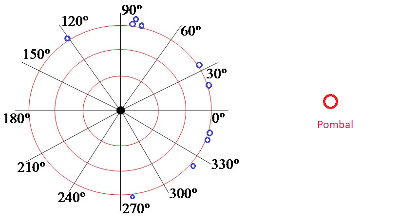

# O teste do sinal e suas variações

## O teste do sinal
  
  
  Os dados consistem de observações de uma amostra aleatória bivariada $(X_1,Y_1),\ldots,(X_m,Y_m)$. Em princípio, o teste foi concebido para variáveis aleatórias contínuas, mas pode ser aplicado para variáveis discretas ou ordinais com algumas restrições.
  
    
  Cada par $(X_i,Y_i)$ será classificado como + ou - se $X_i<Y_i$ ou se $X_i>Y_i$ e como 0 (ou empate) se $X_i=Y_i$. No teste original, os empates são considerados uma inconveniência técnica devido ao instrumento de medida, uma vez que $P(X_i=Y_i)=0$ para variáveis contínuas.
  
Sejam $p_+$ e $p_-$ a probabilidade de ocorrer um par com sinal $+$ e $p_-$ respectivamente. As hipóteses do teste do sinal comparam $p_+$ com $p_-$. Note que $p_+$ pode ser estimada por $T/n$, onde $T$ é o número de sinais positivos. Deste modo, $T$ pode ser utilizada como estatística de teste. Abaixo, apresentamos as principais hipóteses e as respectivas regiões de rejeição. 

Como os empates ocorrem apenas como erro de medida, eles são descartados nesse momento, fazendo com que o tamanho da amostra passe de $n$ para $n'=n-n_0$, onde $n_0$ é o número de empates. Como $p_+$ e $p_-$ são as únicas possibilidades, basta comparar $p_+$ com o valor $1/2$. Temos então as seguintes hipóteses

::: {#tbl-distribuicao}

$$\begin{array}{c|c}\hline 
\hbox{Hipótese} & \hbox{Região de rejeição} \\ \hline
        H_0: p_+\leq \frac{1}{2} & T\geq t_1\\
        H_1:p_+> \frac{1}{2} & \\ \hline
H_0: p_+\geq \frac{1}{2} & T\leq t_0\\
        H_1:p_+< \frac{1}{2} & \\ \hline
        H_0: p_+=\frac{1}{2} & T\leq t_0 \hbox{ ou } T\geq n'-t_0\\
        H_1:p_+\neq \frac{1}{2} & \\ \hline
\end{array}$$

Hipóteses comuns para o teste do sinal com suas respectivas regiões de rejeição. A região de rejeição da hipótese nula simples é discutida mais abaixo. 
:::

Considere inicialmente a hipótese nula simples $H_0: p_+=1/2$. Como $T$ é o número de sinais positivos em uma amostra de tamanho $n'$, temos que, sob $H_0$

$$T\sim\hbox{Binomial}\left(n',\frac{1}{2}\right).$$
Como a distribuição acima é simétrica em torno de $n'/2$, teremos que
$$P\left(T\leq t_0|p_+=\frac{1}{2}\right)=P\left(T\geq n'-t_0|p_+=\frac{1}{2}\right)$$
e, portanto, para obter um teste de nível $\alpha$ basta encontrar o maior valor de $t_0$ que satisfaz

$$P\left(T\leq t_0|p_+=\frac{1}{2}\right)\leq \frac{\alpha}{2}.$$

Para as hipóteses nulas compostas, é fato que, se $X\sim\hbox{Binomial}(m,\theta)$, então 

$$g(\theta)=F(x|\theta)=(m-x){ m\choose x} \int_0^{1-\theta} u^{m-x-1} (1-u)^x du$$
de modo que $g(\theta)=F(x|\theta)$ é uma função monótona decrescente em $\theta$. Portanto, para $H_0:p_+\geq 1/2$

$$\sup_{p_+\geq 1/2}P(T\leq t_0|p_+)=P\left(T\leq t_0|p_+=\frac{1}{2}\right)$$
e o teste de nível $\alpha$ é dado pelo maior valor de $t_0$ tal que

$$P\left(T\leq t_0|p_+=\frac{1}{2}\right)\leq \alpha$$

E, para $H_0:p_+\leq 1/2$

$$\begin{align}\sup_{p_+\leq  1/2}P(T\geq t_1|p_+)&=\sup_{p_+\leq  1/2}\left(1-P(T< t_1|p_+)\right)\\&=P\left(T\geq t_1|p_+=\frac{1}{2}\right)\end{align}$$

e o teste de nível $\alpha$ é dado **pelo menor** valor de $t_1$ tal que

$$P\left(T\geq t_1|p_+=\frac{1}{2}\right)\leq \alpha$$

::: {#exm-}
O item $A$ é produzido usando certo processo. O item $B$ serve para a mesma função, mas é produzido a partir de um novo processo. Uma empresa fabricante deseja determinar se $B$ é preferível a $A$ pelo consumidor. Para este fim, uma amostra de 10 consumidores é selecionada e cada um deles deve utilizar os produtos por um certo período de tempo e em seguida emitir a sua preferência.

Vamos assumir que o sinal + é atribuído quando $B$ é preferível em relação a $A$. Então, podemos formular as seguintes hipóteses:

$$\begin{align*}
    H_0&: p_+\leq 1/2\\
    H_1&: p_+> 1/2
\end{align*}$$

Os seguintes dados foram obtidos:

$$\begin{array}{|l|c|}\hline
     \hbox{Número de pessoas que preferem } B (+)& 8  \\
     \hbox{Número de pessoas que preferem } A (-)& 1 \\
     \hbox{Empates} & 1 \\ \hline
     n' & 8+1=9 \\ 
     t_{obs}&8 \\ \hline
\end{array}$$

Logo, sob $H_0$, $T\sim \hbox{Binomial}(9,1/2)$. O $p$-valor do teste é 
$$P(T\geq 8|p_+=1/2)=P(T>7|p_+=1/2),$$
e no `R` ele é calculado por
```{r}
pbinom(7, 9, .5, lower.tail = FALSE)
```
logo, ao nível de significância de 5%, há evidências de que $B$ é preferível a $A$.

Alternativamente, você pode utilizar o comando, tomando apenas o cuidado de utilizar $n_+=8$ no primeiro argumento.
```{r}
binom.test(8,9, p = .5, alternative = 'greater')
```

:::

<div class='alert alert-success'>
**Distribuição de $T$ para grandes amostras** Para cada par $(X_1,Y_1),\ldots,(X_n,Y_n)$ da amostra sem empates, considere que $Z_i=1$ se $(X_i,Y_i)$ gerou um sinal + e $Z_i=0$ em caso contrário. Então,

$$T=\sum_{i=1}^{n'}Z_i$$
com $E[T]=n'/2$ e $Var[T]=n'/4$. Logo, pelo Teorema Central do Limite, teremos que
$$W_n=\frac{2T-n'}{\sqrt{n'}}\stackrel{D}{\to}N(0,1).$$
e o teste pode ser realizado utilizando a estatística $W_n$.
</div>

::: {#exr-}
Arbuthnott (1710) examinou os dados de batismos em Londres durante 82 anos consecutivos, registrando o número de meninos e meninas. Para cada ano, ele denotou por $+$ o evento "mais meninos que meninas" e por $-$ o oposto. Ele observou que em todos os 82 anos nasceram mais meninos que meninas ($t_{obs} = 82$).Assumindo que a probabilidade de nascerem mais meninos que meninas é $p_+ = 1/2$ (sob a hipótese nula de equilíbrio entre os sexos), teste a hipótese $H_0: p_+ = 1/2$ contra $H_1: p_+ \neq 1/2$.
:::

::: {#exr-}
Dez pombos-correio foram levados a 25 km a oeste de seu pombal. Após serem soltos, desejava-se saber se eles se dispersariam em direções aleatórias ou se tenderiam a voar para leste, em direção ao pombal. Binóculos foram usados para observar as aves, e o ângulo de revoada no momento em que sumiram de vista foi registrado:

$$\begin{array}{ccccc}20 & 35  & 350 & 120 & 85  \\345 & 80 & 320  & 280 & 85 \end{array}$$


A hipótese científica é que os pombos conseguem se orientar e, portanto, devem tender ao leste. A figura abaixo mostra os ângulos observados e a direção do pombal.


 

Os ângulos situados mais a leste do que a oeste (no intervalo $[0^\circ, 90^\circ]$ ou $[270^\circ, 360^\circ]$) serão classificados como $+$ (sucesso), enquanto os demais serão classificados como $-$. Teste a hipótese de que os pombos conseguem se orientar em direção ao seu pombal ao nível de significância de 5%.
:::

:::: {#exr-}
Charles Darwin realizou um experimento para comparar o crescimento de plantas da mesma espécie ($Zea \ mays$), porém com origens distintas: uma semente era fruto de fertilização cruzada e a outra de autofecundação. 
Para controlar fatores ambientais (como luz e nutrientes), Darwin plantou os pares de sementes em lados opostos do mesmo vaso. Os dados abaixo referem-se às alturas (em polegadas) de 15 pares de plantas após um período determinado de crescimento:

$$\begin{array}{c|c|c}
\hline
\text{Par} & \text{Cruzada } (C) & \text{Autofecundada } (A)  \\ \hline
1  & 23,5 & 17,4  \\
2  & 12,0 & 20,4  \\
3  & 21,0 & 20,0 \\
4  & 22,0 & 20,0  \\
5  & 18,0 & 18,4  \\
6  & 21,5 & 18,6  \\
7  & 23,3 & 18,6  \\
8  & 21,0 & 15,3  \\
9  & 22,1 & 16,5  \\
10 & 23,0 & 18,0  \\
11 & 12,0 & 16,3  \\
12 & 23,0 & 18,0  \\
13 & 23,1 & 12,8  \\
14 & 17,1 & 15,5  \\
15 & 21,5 & 18,0  \\ \hline
\end{array}$$
Deseja-se testar se a fertilização cruzada produz plantas com maior crescimento mediano do que a autofecundação. Formule as hipóteses e realize o teste do sinal ao nível de 5%.
:::

::: {#exr-}
Em seus estudos sobre inteligência de primatas, Wolfgang Köhler testou se chimpanzés demonstravam preferência por ferramentas que facilitassem a obtenção de comida. Em um experimento, 12 chimpanzés foram apresentados a dois tipos de varetas para alcançar uma fruta fora da jaula: uma vareta sólida (mais eficiente) e uma vareta flexível (menos eficiente). Cada chimpanzé foi testado uma única vez. Os resultados foram:

$$\begin{array}{l|c}\hline
\hbox{Escolha} & \hbox{Frequência} \\ \hline
\hbox{Vareta Sólida} & 10 \\
\hbox{Vareta Flexível} & 2 \\ \hline \end{array}$$

Teste a hipótese de que os chimpanzés possuem preferência pela ferramenta mais eficiente ao nível de 5%.
:::

::: {#exr-}
Um estudo clínico investigou a eficácia de duas drogas (A e B) para prolongar o sono em 10 pacientes. Cada paciente usou ambas as drogas em noites diferentes. O dado registrado foi o ganho de horas de sono em relação à noite de controle (sem droga).

$$\begin{array}{ccc}\hline
\text{Paciente} & \text{Droga A} & \text{Droga B} \\ \hline
1  & +0,7 & +1,9  \\
2  & -1,6 & +0,8 \\
3  & -0,2 & +1,1 \\
4  & -1,2 & +0,1 \\
5  & -0,1 & -0,1\\
6  & +3,4 & +4,4\\
7  & +3,7 & +5,5\\
8  & +0,8 & +1,6\\
9  & 0,0  & +4,6\\
10 & +2,0 & +3,4\\
\hline
\end{array}$$

Deseja-se testar se a Droga B é superior à Droga A. Realize o teste com nível de significância de 5%.
:::


::: {#exr-}
Para verificar se uma usina hidrelétrica está alterando a concentração de oxigênio dissolvido (OD) em um rio, biólogos coletaram amostras em 12 locais diferentes. Em cada local, uma amostra foi coletada 100 metros acima (montante) da usina e outra 100 metros abaixo (jusante).

$$\begin{array}{lcccc}\hline\text{Local} & \text{Acima } (A) & \text{Abaixo } \\ \hline
1  & 6,5 & 6,2 \\
2  & 7,0 & 6,8 \\
3  & 6,8 & 6,9 \\
4  & 7,2 & 6,5 \\
5  & 6,1 & 6,1 \\
6  & 6,9 & 6,4 \\
7  & 7,4 & 7,0 \\
8  & 6,6 & 6,3 \\
9  & 7,1 & 7,1 \\
10 & 6,7 & 6,2 \\
11 & 7,3 & 6,9 \\
12 & 6,4 & 6,0 \\ \hline\end{array}$$

Teste a hipótese de que a passagem pela usina reduz a concentração de oxigênio dissolvido ao nível de 5%. 
:::
    
::: {#exr-}
O efeito Stroop demonstra a dificuldade que o cérebro tem em processar informações conflitantes. Em um experimento, 10 indivíduos tiveram seus tempos de reação medidos em duas tarefas:

1. **Tarefa Neutra**: Ler o nome de uma cor escrito em tinta preta.

2. **Tarefa de Interferência**: Ler o nome de uma cor escrito em uma tinta de cor diferente (ex: a palavra "AZUL" escrita em vermelho).

Espera-se que o tempo de reação na tarefa de interferência ($T_I$) seja maior que na tarefa neutra ($T_N$).

$$\begin{array}{ccc}\hline
\text{Indivíduo} & T_N \text{ (seg)} & T_I \text{ (seg)} \\ \hline
1  & 0,85 & 1,20 \\
2  & 0,92 & 1,10 \\
3  & 0,78 & 0,75 \\
4  & 1,05 & 1,50 \\
5  & 0,88 & 1,30 \\
6  & 0,95 & 1,45 \\
7  & 1,12 & 1,25 \\
8  & 0,80 & 1,10 \\
9  & 0,98 & 1,40 \\
10 & 0,90 & 1,15 \\ \hline\end{array}$$

Deseja-se testar se o tempo de reação na tarefa de interferência é significativamente maior ao nível de 5%.
:::    


## O teste do sinal para mediana

Seja $X_1,\ldots,X_n$ uma amostra aleatória do modelo $F$ e seja $\theta$ a sua mediana. Sabemos que 
$$\theta=F^{-1}(0,5)\Rightarrow F(\theta)=0,5.$$
Considere a hipótese $H_0:\theta=\theta_0$ contra $H_1:\theta\neq\theta_0$. Seja $Z_i=I_{(\theta_0,\infty)}(X_i)$. Então a estatística $N_+=\sum_{i=1}^n Z_i$ pode ser utilizada para testar $H_0$. 


::: {.panel-tabset}

### Exemplo 
::: {#exm-}
Um modelo de forno de micro-ondas foi projetado para emitir um nível de radiação de no máximo 0,15. Deseja-se testar se um lote desses micro-ondas apresenta um excesso de radiação prejudicial, definido como uma mediana maior que o limite de segurança de 0,15. a mediana da radiação emitida por esses fornos é condizente com esse valor. Foram realizadas as seguintes medidas:

$$\begin{array}{cccccccccc}
0,09& 0,18& 0,10& 0,05& 0,12& 0,40& 0,10& 0,05& 0,03& 0,20\\
0,08& 0,10& 0,30& 0,20& 0,02& 0,01& 0,10& 0,08& 0,16& 0,11\end{array}$$

Utilize o teste do sinal para testar a hipótese de que o lote apresenta excesso de radiação.  
:::

### Resolução

Seja $\theta$ a mediana da radiação emitida. Desejamos testar $H_0:\theta\leq 0,15$ contra $H_1:\theta>0,15$.

Temos que verificar quais valores são maiores/menores que 0,15. Os sinais de cada valor são dados abaixo 

$$\begin{array}{c|c|c|c|c|c|c|c|c|c}
0,09(-)& 0,18(+)& 0,10(-)& 0,05(-)& 0,12(-)& 0,40(+)& 0,10(-)& 0,05(-)& 0,03(-)& 0,20(+)\\
0,08(-)& 0,10(-)& 0,30(+)& 0,20(+)& 0,02(-)& 0,01(-)& 0,10(-)& 0,08(-)& 0,16(+)& 0,11(-)\end{array}$$
logo $n_+=6$. O p-valor deste teste é

```{r}
pbinom(5,20,.5, lower.tail = FALSE)
```
:::


::: {#exr-}
Foram coletadas 15 amostras de papel para medir sua densidade em gramas por centímetro cúbico (g/cm³). Espera-se que a amostra seja proveniente de uma distribuição com mediana iguaç a 0,8. Teste a hipótese de que o lote de papéis é mais denso do que o padrão.


$$\begin{array}{ccccc}
0,816& 0,836& 0,815& 0,822& 0,822\\ 
0,843& 0,824& 0,788& 0,782& 0,795\\
0,805& 0,836& 0,738& 0,772& 0,776\\
\end{array}$$

:::


## O teste de McNemar


Considere uma amostra aleatória bivariada dos vetores $(X_1,Y_1),\ldots,(X_m,Y_m)$, onde as variáveis são binárias.  Assim, os valores possíveis para $(X_i,Y_i)$ são (0,0), (0,1), (1,0) e (1,1). Os dados são sumarizados em uma tabela de contigência $2\times 2$, como esta abaixo:

$$\begin{array}{c|cc}\hline
            & Y_i=0& Y_i=1 \\ \hline 
    X_i=0 & a  & b  \\
    X_i=1 & c  & d  \\ \hline
    \end{array}
$$
onde $a,b,c,d$ são as frequências de cada combinação de $(X,Y)$. O objetivo do teste de McNemar é testar se as marginais de $X$ e $Y$ são iguais. Para tanto, consideramos as seguintes hipóteses:


$$\begin{align*}
    H_0&: P(X=0)=P(Y=0)\\
    H_1&:P(X=0)\neq P(Y=0)
\end{align*}$$


Observe que 

$$\begin{align}P(X=0)&=\sum_{y=0}^1 P(X=0,Y=y)=P(X=0,Y=0)+P(X=0,Y=1)\\
P(Y=0)&=\sum_{x=0}^1 P(X=x,Y=0)=P(X=0,Y=0)+P(X=1,Y=0)
\end{align}$$
Portanto
$$P(X=0)=P(Y=0)\Leftrightarrow P(X=0,Y=1)+P(X=1,Y=0),$$
e as hipóteses podem ser reescritas como 
$$\begin{align*}
&H_0: P(X=0,Y=1)=P(X=1,Y=0)\\
&H_1: P(X=0,Y=1)\neq P(X=1,Y=0)\end{align*}$$


Observe então que a nossa atenção está voltada para quando $X$ e $Y$ assumem valores distintos. O teste de McNemar pode ser visto como uma variação do teste do sinal, onde as distinções dos pares geram os sinais, conforme a classificação abaixo:

1. Se $(X_i,Y_i)=(0,1)$ atribuímos +

2. Se $(X_i,Y_i)=(1,0))$ atribuímos -

3. Se $(X_i.Y_i)$ é igual a (0,0) ou (1,1), atribuímos 0 (empate).

Identificando $p_+=P(X=0,Y=1)$ e $p_-=P(X=1,Y=0)$, a hipótese nula do teste de McNemar é equivalente a 
    $$H_0:p_+=p_-\hbox{  , ou ainda,  }H_0:p_+=1/2.$$

A estatística do teste é o número de sinais positivos, ou seja $N_+=b$. Como o tamanho da amostra após a eliminação dos empates é $n'=b+c$, teremos que, sob $H_0$ 

$$N_+\sim\hbox{Binomial}\left(b+c,\frac{1}{2}\right).$$

Para $b>20$, pode-se utilizar o TCL para realizar esse teste. Nesses casos, teremos que, sob $H_0$

$$\frac{N_+-E(N_+)}{\sqrt{Var(N_+)}}=\frac{2N_+-(b+c)}{\sqrt{n'}}=\frac{b-c}{\sqrt{b+c}}\stackrel{D}{\to}N(0,1)$$
e é usual definir a estatística do teste de McNemar por
$$T=\frac{(b-c)^2}{b+c}\stackrel{D}{\to}\chi^2_1.$$


A tabela abaixo resume o uso das estatísticas apresentadas.

$$\begin{array}{c|c|c}\hline\hbox{Estatística} & N_+=b & T=\frac{(b-c)^2}{b+c} \\ \hline 
\hbox{Distribuição sob }H_0 & \hbox{Binomial}(b+c,1/2) & \chi^2_1 \\ \hline
\hbox{p-valor} & 2\min\{P(N_+\geq n_+),P(N_+\leq n_+)\} & P(T>t) \\ \hline
\end{array}


$$

::: {#exm-}
Antes de um debate nacional entre dois candidatos à presidência dos EUA, uma amostra de 100 eleitores foi selecionada e o seu candidato anotado. 84 escolheram o candidato democrata e os 16 restantes o republicano. Após o debate, houveram mudanças de opinião, conforme a tabela abaixo:

$$\begin{array}{c|cc|c}\hline
    \hbox{Antes\Depois}  & \hbox{Democrata} & \hbox{Republicano}  & \hbox{Total}\\ \hline
     \hbox{Democrata}  & 63 & 21 & 84 \\
      \hbox{Republicano} & 4 & 12 & 16 \\ \hline
    \end{array}$$

O objetivo é determinar se houve alteração na opinião dos eleitores após o dedate. Podemos escrever a seguinte hipótese nula
    
$$H_0:\hbox{ o alinhamento político dos eleitores não foi alterado com o debate.}$$
    
Vamos considerar que $0$ representa o voto para o candidato democrata e 1 representa o voto para o republicano. Vamos considerar ainda que $X_i$ é o voto do $i$-ésimo indivíduo antes do debate e $Y_i$ é o mesmo depois. Então, a hipótese nula pode ser reescrita como 
    
    $$H_0:P(X=0)=P(Y=0).$$

Identificando $b=21$ e $c=4$, podemos realizar o teste de McNemar:

```{r}
b = 21
c = 4
binom.test(b, b+c, .5) 
```
que, um p-valor de 0,0009, nos leva a rejeitar a hipótese nula. Alternativamente, como $b+c>20$, podemos realizar o teste de McNemar aproximado. Como

$$t_{obs}=\frac{(21-4)^2}{21+4}=\frac{289}{25}=11,56$$

teremos que o p-valor deste teste é

```{r}
t = 11.56
pchisq( t, 1, lower.tail=FALSE)
```
o que também nos leva a rejeitar a hipótese nula, concluindo que alinhamento político dos eleitores foi alterado com o debate.
:::

<div class='alert alert-success'>
**Importante.** Conforme discutido, o teste de McNemar é um teste do sinal, realizado de maneira condicional através de $N_+|b+c$. Contudo, diferente do caso no qual os empates são esporádicos, os valores descartados das diagonais podem ser substanciais. Considere a tabela abaixo, no mesmo contexto do exemplo anterior, mas com outros valores:

$$\begin{array}{c|cc|c}\hline
    \hbox{Antes\Depois}  & \hbox{Democrata} & \hbox{Republicano}  & \hbox{Total}\\ \hline
     \hbox{Democrata}  & 499 & 1 & 500 \\
      \hbox{Republicano} & 9 & 491 & 500 \\ \hline
    \end{array}$$
Note que a probabilidade estimada de "Democrata antes do debate" é a mesma de "Democrata depois do debate". Ao ignorar os empates e focar apenas nas mudanças temos uma proporção de 90% de indivíduos que mudaram do candidado republicano para o democrata. É importante ressaltar o debate político tem como um de seus objetivos conseguir uma mudança de opinião. 

Isso ilustra que, mesmo que o teste de McNemar tenha sido desenhado para testar $H_0:P(X=0)=P(Y=0)$, sua real relevância é detectar mudanças.
</div>

::: {#exr-}
Para testar o efeito de uma nova droga, um grupo de 100 pacientes foi avaliado em dois momentos. Em um dos momentos, o paciente recebeu um placebo e no outro a nova droga.
Como resultado, 35 pácientes sentiram alívio com o placebo e 55 pacientes sentiram alívio com a nova droga. Foram observados os seguintes pares discordantes:

* Pessoas que sentiram alívio com o placebo, mas não com a droga: 15.

* Pessoas que não sentiram alívio com o placebo, mas sentiram com a droga: 35

Complete a tabela abaixo. Em seguida, realize o teste de McNemar para testar se a nova droga tem efeito.

$$\begin{array}{c|cc|c}\hline \hbox{placebo/nova drogra} & \hbox{alívio} & \hbox{não alívio} & \hbox{Total} \\ \hline
\hbox{alívio} & & 15 & 35 \\ \hbox{não alívio} & 35 & & \\ \hline \hbox{Total} & 55  & & \\ \hline\end{array}$$
:::

::: {#exr-}
Para testar a associação entre a amigdalectomia (remoção das amígdalas) e a doença de Hodgkin, Hollander e Wolfe (1999), analisaram 85 pares de irmãos. Em cada par, um dos irmãos possuía a doença e o outro não (amostra pareada por genética e ambiente). Os dados observados foram:

* Em 26 pares, ambos os irmãos haviam passado pela cirurgia.
* Em 37 pares, nenhum dos irmãos havia passado pela cirurgia.
* Em 15 pares, o irmão com a doença tinha feito a cirurgia, mas o saudável não.
Em 7 pares, o irmão saudável tinha feito a cirurgia, mas o com doença não.

Utilize o Teste de McNemar para verificar se há evidência de que a proporção de amigdalectomias difere entre os indivíduos doentes e saudáveis.
:::

::: {#exr-}
O desempenho de 28 vendedores foi classificado como "Aceitável" ou "Não Aceitável" antes e depois de assistirem a um filme de treinamento. Antes do filme, 9 eram aceitáveis; após o filme, esse número subiu para 18. Dos que mudaram de categoria, 13 vendedores passaram de "Não Aceitável" para "Aceitável", e 4 vendedores passaram de "Aceitável" para "Não Aceitável". Investigue se o treinamento teve um efeito positivo significativo na avaliação dos vendedores
:::

::: {#exr-}
Um estudo de opinião pública acompanhou um grupo de 1.600 cidadãos para avaliar a taxa de aprovação de um Primeiro-Ministro em dois momentos distintos, com um intervalo de seis meses entre as pesquisas. Os resultados mostraram que:

* 794 pessoas aprovaram o governo em ambas as pesquisas.

* 570 pessoas desaprovaram em ambas.

* 150 pessoas que aprovavam na primeira pesquisa passaram a desaprovar na segunda.

* 86 pessoas que desaprovavam na primeira pesquisa passaram a aprovar na segunda

Determine se houve uma mudança significativa na aprovação do Primeiro-Ministro. 
:::

::: {#exr-}
Um estudo de persuasão utilizou uma amostra de 30 pessoas para verificar a eficácia de uma newsletter informativa em convencer cidadãos a favor de um novo projeto de imposto de renda (imposto fixo).
Antes de lerem o informativo, 11 pessoas eram a favor do projeto.
Após a leitura, verificou-se que:

* 5 pessoas que já eram a favor mantiveram sua opinião.

* 6 pessoas que eram contra mantiveram sua posição de oposição.

* Os demais mudaram de opinião.

Calcule quantos indivíduos mudaram de posição em cada direção e aplique o Teste de McNemar para determinar se o informativo foi eficaz em persuadir as pessoas a favor do projeto

:::


## O teste de Cox e Stuart para tendência monótona*

Os dados consistem de observações de uma sequência de variáveis aleatórias $X_1,\ldots,X_m$, onde o índice representa o tempo. O objetivo é determinar se existe tendência monótona, podendo ainda classificar como de crescimento ou decrescimento. 

Seja $c=m/2$ se $m$ for par ou $c=(m+1)/2$ em caso contrário. As variáveis são agrupadas formando os pares $(X_1,X_{1+c}),(X_2,X_{2+c}),\ldots,(X_{m-c},X_m)$. Em seguida, para cada $i$:

1. Atribua o sinal + se $X_i<X_{i+c}$
2. Atribua o sinal - se $X_i>X_{i+c}$
3. Atribua 0 (empate) se $X_i=X_{i+c}$

Deste modo, podemos utilizar o teste do sinal. Como o usual, seja $n'= n_++n_-$. A ideia é simples: se forem observados mais valores positivos(negativos), a segunda metade da série exibe valores maiores que a primeira, evidenciando tendência monótona crescente(decrescente). Se $N_+$ estiver próximo de $n'/2$, não há evidências para tendência. As hipóteses são sumarizadas na tabela abaixo.


$$\begin{array}{c|c} \hbox{Hipótese sobre a tendência} & \hbox{Hipótese como função de }p_+\\\hline \\ 
\begin{cases}H_0: \hbox{não há tendência}\\ 
H_1: \hbox{há tendência monótona}\end{cases} & \begin{cases}H_0: p_+=\frac{1}{2}\\ 
H_1: p_+\neq\frac{1}{2}\end{cases}\\ \hline
\begin{cases}H_0: \hbox{não há tendência}\\ 
H_1: \hbox{há tendência crescente}\end{cases} & \begin{cases}H_0: p_+\leq\frac{1}{2}\\ 
H_1: p_+>\frac{1}{2}\end{cases}\\ \hline
\begin{cases}H_0: \hbox{não há tendência}\\ 
H_1: \hbox{há tendência decrescente}\end{cases} & \begin{cases}H_0: p_+\geq\frac{1}{2}\\ 
H_1: p_+<\frac{1}{2}\end{cases}\\ \hline
\end{array}$$    

::: {#exm-} 
Foi registrado o total de precipitação anual por 19 anos. O objetivo é determinar se há tendência (monótona) de precipitação. As precipitações, em polegadas, foram
    
$$\begin{array}{cccccc}
    45,25  & 45,83 & 41,77 & 36,26 & 45,37 & 52,25\\
    33,37 & 57,16 & 35,37 & 58,32 & 41,05 & 33,72 \\
    45,73 & 37,90 & 41,72 & 36,07 & 49,83 & 36,24\\\
    39,90 &       &       &       &       & \\
    \end{array}$$

Como $m=19$, temos $c=(19+1)/2=10$. Abaixo, organizamos o pares e os classificamos para a aplicação do teste
        
$$\begin{array}{l|l}
                 (X_1,X_{11}) = (45,25\;,\;   41,05)\equiv -
                 & (X_6,X_{16}) = (52, 25\;,\;   36,07)\equiv -\\
                 (X_2,X_{12}) = (45,83\;,\;       33,72)\equiv -
                 & (X_7,X_{17}) = (35,37\;,\;  49,83)\equiv +\\
                 (X_3,X_{13}) = (41,77\;,\;   45,73)\equiv +
                 & (X_8,X_{18}) = (57,16   \;,\;       36,24)\equiv -\\
                 (X_4,X_{14}) = ( 36,26   \;,\;     37,09 )\equiv +                  & 
                 (X_9,X_{19}) = (35,37 \;,\;  39 ,90)\equiv +  
                 \\
                 (X_5,X_{15}) = (45,   
                 375\;,\;       41,72)\equiv -
                 & \\
            \end{array}$$

e obtivemos $n_{+}=4$. As hipóteses são

* $H_0$: não há tendência (a amostra é aleatória)

* $H_1:$ há tendência

Como há 9 pares, teremos que, sob $H_0$, $T\sim\hbox{Binomial}(9,1/2)$. O p-valor o teste é
```{r}
binom.test(4,9,.5)
```
logo não há evidências de tendência monótona. Abaixo, apresentamos o gráfico da série temporal.

```{r}
x <- c(45.25, 45.83, 41.77, 36.26, 45.37, 52.25,
    33.37, 57.16, 35.37, 58.32, 41.05, 33.72,
    45.73, 37.90, 41.72, 36.07, 49.83, 36.24,
    39.90  )
ts.plot(x, main= 'Precipitação', xlab='Anos')
```
:::


